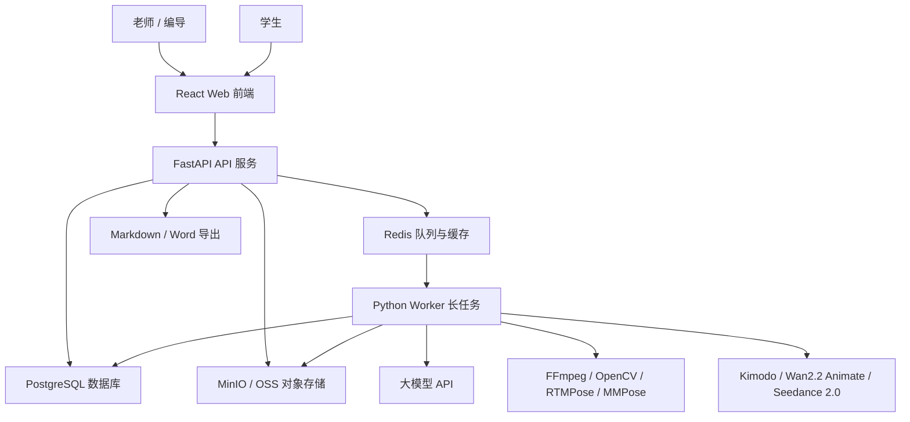

# 客韵智演 / hakka-stage-ai

AI 歌舞剧教学与排演辅助系统。当前仓库已接入课前教案生成、T02 多版本教案、课堂互动方案、歌舞剧剧本创编、唱段适配、歌舞融合、分角色训练计划、排练 / 演出复盘和课后练习提交复核。系统通过 FastAPI 创建 AI 生成任务，Redis 负责排队，Python Worker 调用 DeepSeek 或百炼 Qwen 生成结构化初稿，前端提供可编辑、可保存、可导出的工作台；M05 支持在保留整份计划导出的同时，按角色保存并导出独立 Markdown 训练卡。

## 当前范围

- 已包含：Docker Compose、FastAPI `/health`、邮箱密码登录、登录后单个 / JSON 批量创建账号、Bearer 鉴权、个人资料与密码管理、课前教案生成 API、T02 教案变体生成 / 版本关系 / 快照对照 / Markdown 导出 API、课堂互动方案生成与教案版本预填 API、歌舞剧剧本生成 API、唱段适配 API、歌舞融合 API、分角色训练计划及按角色训练卡 Markdown 导出 API、M08 排练复盘生成 / 编辑 / Markdown 导出 API、M08 MinIO 私有视频上传与鉴权代理播放、课后练习提交与本地视频上传 API、基础练习观察报告和老师复核 API、RunningHub 克隆音频工作台、支持多参考图合成单图的 GRS AI 图生图工作台、阿里云百炼 Wan 2.7 首帧 / 首尾帧图生视频工作台、PostgreSQL 开发期自动建表、Redis AI 任务队列、Python Worker 调用 DeepSeek / 百炼 Qwen，以及对应的 React 工作台页面。
- 暂不包含：复杂权限与业务数据按账号隔离、可运行 Web 课堂游戏、2D / 3D 游戏、课堂 TTS 与设备控制、音频自动分析、曲谱解析、M08 视频内容自动分析、真实视频姿态分析、标准动作 DTW 纠错、LLM 练习报告生成、动作生成、Word 导出。
- 算力边界：本地开发环境仅用于服务联调、轻量功能验证和短样例测试；不要在本地跑长视频批量分析、大模型训练 / 微调、大规模模型测试或大规模视频生成等高负载任务，这类任务应放到云端 GPU 或服务器执行。

M05 详情页的每张角色任务卡提供“保存并导出训练卡”操作：系统会先保存页面上的全部编辑内容，再按当前角色索引下载独立训练卡，避免导出旧稿。

T02 是 T01 教案生成的增强能力：老师先保存当前确认稿，再按低龄版、基础版、进阶版或演出版中的一个方向创建一级变体。每次只生成一个版本；变体复用原教案的 `course_id`，同时保存生成时原稿快照，因此原教案后续修改或删除都不会破坏版本对照。首版支持独立编辑、课堂互动预填和 Markdown 导出，不包含批量生成、多级版本树、自动文本差异或 Word 导出。

## 项目目录结构

```text
hakka-stage-ai/
├── backend/              # FastAPI API 服务，使用 uv 管理依赖
│   ├── app/              # 后端应用代码，按 api/core/models/schemas/services 分层
│   │   ├── api/router.py # 后端 API 总路由，统一汇总各业务模块
│   │   └── services/     # 路由复用的业务辅助逻辑和外部服务封装
│   ├── pyproject.toml    # 后端依赖声明
│   └── uv.lock           # 后端依赖锁文件
├── worker/               # Python Worker 长任务服务，使用 conda 管理依赖
│   ├── app/              # Worker 入口和健康检查
│   └── environment.yml   # Worker conda 环境定义，包含 LLM / Redis / PostgreSQL 客户端依赖
├── frontend/             # React + Vite + TypeScript + shadcn/ui + Tailwind CSS 前端
│   ├── src/              # 前端源码
│   └── package-lock.json # 前端依赖锁文件
├── docs/                 # 需求文档、技术方案、评审报告等项目文档
├── docker-compose.yml    # 本地 Docker 服务编排
├── .env.example          # 本地环境变量示例
└── AGENTS.md             # Codex 协作规范
```

## 架构总览

系统采用“前端应用 + FastAPI API 服务 + Python Worker + 数据库 + 对象存储 + 异步队列”的结构。API 服务负责接收请求、管理数据和创建任务；耗时的大模型调用、媒体处理、动作生成和练习分析由 Python Worker 执行。



## 依赖管理约定

- `backend/`：使用 `uv + pyproject.toml + uv.lock` 管理 FastAPI 后端依赖。
- `worker/`：使用 Miniforge / conda 的 `environment.yml` 管理 Python Worker 依赖，后续承载大模型调用、媒体处理、动作生成、练习纠错和 AI 报告生成。
- 不把 `torch / mmcv / mmpose / opencv` 等重依赖装进后端环境，避免 API 服务变重，也方便以后把 worker 单独迁到云端 GPU。

## 前置工具

协同开发前建议先确认本机有以下工具。只用 Docker Compose 全栈启动时，通常只需要 Docker Desktop；如果要在宿主机本地分别调试 backend、worker、frontend，再安装 Node.js、Miniforge / conda 和 uv。

- Docker Desktop：用于一键启动 PostgreSQL、Redis、MinIO、后端、worker 和前端。
- Node.js 22+：用于本地启动 Vite 前端，并安装 shadcn/ui、Tailwind CSS 等前端依赖。
- Miniforge / conda：用于创建 `worker/` 的 Python Worker 环境。
- uv：用于创建 `backend/` 的 FastAPI 后端虚拟环境。

## 环境变量说明

复制 `.env.example` 为 `.env` 后，Docker Compose 会自动读取根目录 `.env`。当前骨架不包含真实密钥，默认值只用于本地开发和演示。

| 变量 | 默认值 | 说明 |
|---|---|---|
| `PROJECT_NAME` | `hakka-stage-ai` | 项目名，后端健康检查和日志展示使用 |
| `BACKEND_HOST` | `0.0.0.0` | 后端监听地址，Docker 中保持默认即可 |
| `BACKEND_PORT` | `8000` | 后端端口 |
| `CORS_ORIGINS` | `http://localhost:5173,http://127.0.0.1:5173` | 允许访问后端 API 的前端来源 |
| `AUTH_SECRET_KEY` | `local-dev-only-change-me-at-least-32-bytes` | JWT 签名密钥；公开部署前必须替换为至少 32 字节的随机字符串 |
| `AUTH_ACCESS_TOKEN_MINUTES` | `480` | 登录访问令牌有效期，单位分钟 |
| `AUTH_COOKIE_SECURE` | `false` | HTTPS 部署时设为 `true`，保护媒体播放使用的 HttpOnly Cookie |
| `BOOTSTRAP_ACCOUNT_EMAIL` | 空 | 全新数据库首次启动时创建首账号使用；已有账号时忽略 |
| `BOOTSTRAP_ACCOUNT_PASSWORD` | 空 | 首账号初始密码；创建成功后必须从部署环境删除 |
| `BOOTSTRAP_ACCOUNT_DISPLAY_NAME` | `平台初始账号` | 首账号显示名称 |
| `BOOTSTRAP_ACCOUNT_ROLE` | `teacher` | 首账号身份，可选 `teacher` 或 `student` |
| `VITE_API_BASE_URL` | `auto` | 前端请求后端的基础地址；`auto` 会按当前访问主机自动请求同一台机器的 `8000` 端口 |
| `FRONTEND_HOST_PORT` | `5173` | Docker 映射到宿主机的前端端口；端口被占用时可在本地 `.env` 改为 `3000` 等可用端口 |
| `DEEPSEEK_API_KEY` | 空 | DeepSeek 本地真实密钥，只写入 `.env`，不能提交到 Git |
| `DEEPSEEK_BASE_URL` | `https://api.deepseek.com` | DeepSeek OpenAI 兼容接口地址 |
| `QWEN_API_KEY` | 空 | 百炼 Qwen 本地真实密钥，只写入 `.env`，不能提交到 Git |
| `QWEN_BASE_URL` | `https://dashscope.aliyuncs.com/compatible-mode/v1` | 百炼 OpenAI 兼容接口地址 |
| `LLM_DEFAULT_PROVIDER` | `deepseek` | 默认大模型供应商，可在每次生成时改选 |
| `LLM_DEFAULT_MODEL` | `deepseek-v4-flash` | 默认教案生成模型 |
| `LLM_DEFAULT_REASONING_LEVEL` | `standard` | 默认推理强度，可选 `off`、`standard`、`enhanced` |
| `LLM_MOCK_MODE` | `false` | API Key 或网络不可用时可临时设为 `true`，使用本地演示教案兜底 |
| `LLM_TIMEOUT_SECONDS` | `90` | Worker 调用大模型的单次请求超时时间 |
| `DASHSCOPE_API_KEY` | 空 | 百炼 Wan 视频服务端密钥；建议使用独立的北京地域密钥，只写入 `.env` |
| `DASHSCOPE_BASE_URL` | `https://dashscope.aliyuncs.com` | 百炼原生 API 根地址；生产环境可改为同地域业务空间专属域名，不要填写 `/compatible-mode/v1` |
| `VIDEO_PUBLIC_BASE_URL` | 空 | 百炼拉取本地首尾帧时使用的公网 HTTPS 后端根地址；纯本地联调可留空并使用公网图片 URL |
| `VIDEO_TIMEOUT_SECONDS` | `30` | 创建与查询百炼异步任务的单次 HTTP 超时 |
| `VIDEO_MOCK_MODE` | `false` | 不调用真实 Wan、只验证上传与异步状态链路 |
| `VIDEO_IMAGE_MAX_UPLOAD_MB` | `20` | Wan 工作台单张首帧 / 尾帧上传上限 |
| `GRSAI_API_KEY` | 空 | GRS AI 图生图服务端密钥，只写入 `.env`，不会返回前端 |
| `GRSAI_BASE_URL` | `https://grsai.dakka.com.cn` | GRS AI 图生图节点，可切换到其他官方节点 |
| `MEDIA_MOCK_MODE` | `true` | 原克隆音频 / 图生图工作台的安全联调模式，不产生第三方费用 |
| `MEDIA_MAX_UPLOAD_MB` | `200` | 原媒体工作台单个输入素材上传上限 |
| `RUNNINGHUB_API_KEY` | 空 | RunningHub 克隆音频服务端密钥 |
| `RUNNINGHUB_BASE_URL` | `https://www.runninghub.cn` | RunningHub API 根地址 |
| `POSTGRES_HOST` | `postgres` | PostgreSQL 主机名；Docker 内使用 `postgres`，宿主机本地开发通常使用 `localhost` |
| `POSTGRES_PORT` | `5432` | PostgreSQL 端口 |
| `POSTGRES_HOST_PORT` | `5432` | Docker 映射到宿主机的 PostgreSQL 端口；容器内服务仍固定使用 `POSTGRES_PORT` |
| `POSTGRES_DB` | `hakka_stage_ai` | PostgreSQL 数据库名 |
| `POSTGRES_USER` | `hakka` | PostgreSQL 用户名 |
| `POSTGRES_PASSWORD` | `hakka_password` | PostgreSQL 密码，本地演示默认值 |
| `REDIS_HOST` | `redis` | Redis 主机名；Docker 内使用 `redis`，宿主机本地开发通常使用 `localhost` |
| `REDIS_PORT` | `6379` | Redis 端口 |
| `MINIO_ENDPOINT` | `http://minio:9000` | MinIO API 地址；Docker 内使用 `http://minio:9000`，宿主机本地开发通常使用 `http://localhost:9000` |
| `MINIO_BROWSER_REDIRECT_URL` | `http://localhost:9001` | MinIO 控制台地址 |
| `MINIO_ACCESS_KEY` | `minioadmin` | MinIO 本地演示访问账号 |
| `MINIO_SECRET_KEY` | `minioadmin` | MinIO 本地演示访问密码 |
| `MINIO_BUCKET` | `hakka-stage-ai` | 默认对象存储桶名 |
| `M08_VIDEO_MAX_UPLOAD_MB` | `200` | M08 单个排练 / 演出视频附件的上传上限，单位 MB |

### 时间与时区约定

- PostgreSQL、后端和 Worker 统一保存、计算 UTC 时间；现有 `timestamp without time zone` 字段中的值按 UTC 解释，禁止直接批量加 8 小时。
- API Schema 会把 UTC 时间序列化为带 `Z` 的 ISO 8601 字符串，第三方客户端应按时区感知时间解析。
- 前端所有记录时刻统一使用 `frontend/src/lib/format.ts`；该工具同时兼容历史无后缀时间和新版带时区时间。
- `event_date` 等纯日历日期不代表具体时刻，不做 UTC 转换，避免日期跨天。

### 账号创建边界

- 平台不提供匿名注册接口；`POST /api/accounts` 和 `POST /api/accounts/batch` 都必须先登录并携带 Bearer 令牌。
- 全新数据库没有可登录账号时，可临时填写 `BOOTSTRAP_ACCOUNT_EMAIL` 和 `BOOTSTRAP_ACCOUNT_PASSWORD`。后端只会在账号表为空时创建一次首账号；创建成功后应删除初始密码配置并重启后端。
- 批量接口一次接受 1-50 个账号。任一字段不合法、同批邮箱重复或数据库已有邮箱时，整批事务回滚，不会产生半成功数据。
- 批量 JSON 示例：

```json
{
  "accounts": [
    {
      "email": "student01@example.com",
      "password": "student2026",
      "display_name": "学生一",
      "role": "student"
    },
    {
      "email": "teacher02@example.com",
      "password": "teacher2026",
      "display_name": "李老师",
      "role": "teacher"
    }
  ]
}
```

### M08 视频存储边界

- 当前只有 M08 排练 / 演出复盘视频使用 MinIO；T06 课后练习继续使用 `/uploads/practice/` 本地开发链路，本次未改造其接口和数据结构。
- M08 对象保存在私有桶的 `rehearsal-reviews/` 前缀下，浏览器通过后端 `/api/rehearsal-reviews/{id}/video` 代理播放，不获得 MinIO 永久公开地址。
- AI 仅整理老师填写的观察记录；上传视频仅供人工查看，系统未分析视频内容。当前已要求登录访问，但尚未实现班级权限和业务数据按账号隔离，仍不应上传真实敏感学生视频。

## Docker Compose 全栈启动

如果只是想把系统跑起来、验证环境或做整体联调，优先使用 Docker Compose 全栈启动。

```bash
cp .env.example .env
docker compose up --build
```

如果希望后台运行，使用：

```bash
docker compose up --build -d
```

启动后访问：

- 前端：http://localhost:5173
- 后端健康检查：http://localhost:8000/health
- FastAPI Swagger UI：http://localhost:8000/docs
- MinIO 控制台：http://localhost:9001
- PostgreSQL：localhost:5432
- Redis：localhost:6379

验证 Compose 配置：

```bash
docker compose config
```

注意：`docker compose config` 会展开 `.env` 里的真实密钥，只适合本机排查，不要把完整输出贴到公开位置。

停止服务：

```bash
docker compose down
```

如果需要同时删除本地数据卷：

```bash
docker compose down -v
```

### 按改动范围重建服务

日常开发不需要每次都完整重建所有服务，按实际改动范围执行即可。

| 改动内容 | 推荐命令 |
|---|---|
| 只改 `.env` | `docker compose up -d` |
| 只改后端代码或后端依赖 | `docker compose up --build -d backend` |
| 只改 worker 代码或 `worker/environment.yml` | `docker compose up --build -d worker` |
| 只改前端代码或前端依赖 | `docker compose up --build -d frontend` |
| 改了 Compose / Dockerfile / 多个服务 | `docker compose up --build -d` |


## 日常开发启动：Docker 基础设施 + 本地业务服务

日常修改代码时，建议只用 Docker 启动 PostgreSQL、Redis、MinIO，把 backend、worker、frontend 放在宿主机本地启动。这样后端可以自动 reload，前端可以热更新，worker 后续调试 AI / 媒体依赖也更方便。

首次本地开发前建议准备环境变量文件，Docker Compose 会自动读取根目录 `.env`：

```bash
cp .env.example .env
```

先启动基础设施：

```bash
docker compose up postgres redis minio
```

后端：

```bash
cd backend
uv sync
uv run uvicorn app.main:app --reload --host 0.0.0.0 --port 8000
```

后端本地启动时会默认使用 `localhost:5432`、`localhost:6379` 和 `http://localhost:9000` 连接基础设施；如果你改了 `.env` 中的端口、账号或服务地址，再同步设置对应的 `POSTGRES_*`、`REDIS_*`、`MINIO_*` 环境变量。

Worker：

```bash
cd worker
conda env create -f environment.yml
conda activate hakka-worker
python -m app.main
```

如果 `hakka-worker` 已经存在，使用更新命令：

```bash
cd worker
conda env update -f environment.yml --prune
conda activate hakka-worker
```

前端：

```bash
cd frontend
npm install
npm run dev -- --host 0.0.0.0
```

## 常用验证命令

提交前建议跑以下轻量检查：

```bash
docker compose config

cd backend
uv sync
uv run python -m compileall app

cd ../worker
conda run -n hakka-worker python -m app.healthcheck
conda run -n hakka-worker python -m compileall app

cd ../frontend
npm run build
```

查看 Docker 服务状态：

```bash
docker compose ps
```

## Troubleshooting

### 端口被占用

如果 `5173`、`8000`、`5432`、`6379`、`9000` 或 `9001` 已被其他程序占用，先关闭占用程序，或修改 `.env` 和启动命令中的端口。修改后建议重新执行：

```bash
docker compose config
```

### 忘记复制 `.env`

Docker Compose 启动前建议先执行：

```bash
cp .env.example .env
```

后端本地启动带有多数默认值，但调用真实模型时必须在 `.env` 或当前终端环境中配置 `DEEPSEEK_API_KEY` 或 `QWEN_API_KEY`。

### `hakka-worker` 环境已存在

如果首次创建时报环境已存在，不要重复创建，改用更新命令：

```bash
cd worker
conda env update -f environment.yml --prune
conda activate hakka-worker
```

### 前端显示后端未连接

先确认后端健康检查可访问：

```bash
curl http://localhost:8000/health
```

如果后端正常但前端仍报错，检查 `VITE_API_BASE_URL`。默认建议保持 `auto`，这样通过 `localhost:5173` 或局域网 IP 访问前端时，都会自动请求同一主机的 `8000` 端口。修改后需要重启 Vite 前端。

### Docker 镜像拉取慢或中断

本项目镜像和依赖首次下载可能较慢。遇到 `unexpected EOF`、`IncompleteRead`、`failed to resolve source metadata` 等网络中断时，通常可以直接重试原命令，Docker 会复用已经下载的层。

如果失败点是 worker 的 Miniforge 基础镜像，先单独拉固定版本：

```bash
docker pull condaforge/miniforge3:26.3.2-3
docker compose build worker
```

worker 的基础镜像已固定为 `condaforge/miniforge3:26.3.2-3`，避免继续使用会漂移的 `latest`。
只要本机还保留这个基础镜像，并且没有显式加 `--pull`，后续重建 worker 会复用本地基础镜像层，不会每次重新下载 Miniforge 镜像。

不要把 `worker/Dockerfile` 改回 `latest`，否则不同时间构建可能拿到不同基础环境，也更容易受远端镜像变化影响。

## Git 提交注意

- 应提交：源码、`pyproject.toml`、`uv.lock`、`environment.yml`、`package-lock.json`、Dockerfile、Compose 配置和文档。
- 不应提交：`.env`、`backend/.venv/`、`node_modules/`、`dist/`、缓存目录和本地日志。
- 当前仓库不提交真实密钥，`.env.example` 只保留本地演示默认值和密钥占位。

## 贡献流程

本项目当前以小团队协同开发为主，建议使用以下流程：

1. 从 `main` 拉取最新代码。
2. 为每个任务新建分支，建议命名为 `feature/xxx`、`fix/xxx` 或 `docs/xxx`。
3. 修改代码前先阅读 `AGENTS.md` 和本 README，遵守 backend / worker / frontend 的依赖管理边界。
4. 提交前运行“常用验证命令”中的轻量检查，不在本地开发环境跑长视频批量分析、大模型训练 / 微调、大规模模型测试或大规模视频生成。
5. 提交信息使用简洁中文或英文，例如 `chore: 初始化项目骨架`、`feat: 增加教案生成接口`。
6. 推送分支后在 GitHub 发起 Pull Request，由组员或负责人 review 后合并。

## 下一步建议

1. 增加 Alembic 迁移骨架，替换开发期自动建表。
2. 增加管理员邀请、账号停用、班级关系和业务数据按账号隔离。
3. 为 M08 增加鉴权后的附件访问控制，并通过 MinIO 生命周期策略清理未提交表单产生的孤立对象。
4. 为其他尚未闭环的教学模块继续补充接口级 Mock 流程和页面手测记录。
5. 在重要报告模块补 Word 导出。
