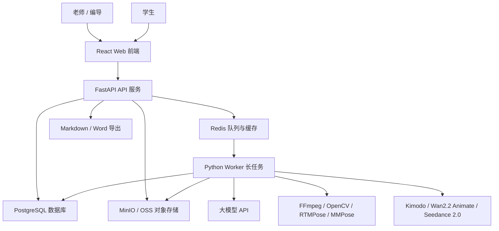

# 客韵智演 / hakka-stage-ai

AI 歌舞剧教学与排演辅助系统。当前仓库已进入第一个业务功能：课前教案生成。系统通过 FastAPI 创建教案生成任务，Redis 负责排队，Python Worker 调用 DeepSeek 或百炼 Qwen 生成结构化教案，前端提供可编辑的教案工作台。

## 当前范围

- 已包含：Docker Compose、FastAPI `/health`、课前教案生成 API、PostgreSQL 开发期自动建表、Redis AI 任务队列、Python Worker 调用 DeepSeek / 百炼 Qwen、React 教案生成与编辑页、基础环境变量示例。
- 暂不包含：登录鉴权、复杂权限、视频分析、AI 练习报告、动作生成、Word 导出。
- 算力边界：本地开发环境仅用于服务联调、轻量功能验证和短样例测试；不要在本地跑长视频批量分析、大模型训练 / 微调、大规模模型测试或大规模视频生成等高负载任务，这类任务应放到云端 GPU 或服务器执行。

## 项目目录结构

```text
hakka-stage-ai/
├── backend/              # FastAPI API 服务，使用 uv 管理依赖
│   ├── app/              # 后端应用代码，按 api/core/models/schemas/services 分层
│   │   ├── api/router.py # 后端 API 总路由，统一汇总各业务模块
│   │   └── services/     # 路由复用的业务辅助逻辑和外部服务封装
│   ├── pyproject.toml    # 后端依赖声明
│   └── uv.lock           # 后端依赖锁文件
├── worker/               # Python Worker 长任务服务，使用 conda 管理依赖
│   ├── app/              # Worker 入口和健康检查
│   └── environment.yml   # Worker conda 环境定义，包含 LLM / Redis / PostgreSQL 客户端依赖
├── frontend/             # React + Vite + TypeScript 前端
│   ├── src/              # 前端源码
│   └── package-lock.json # 前端依赖锁文件
├── docs/                 # 需求文档、技术方案、评审报告等项目文档
├── docker-compose.yml    # 本地 Docker 服务编排
├── .env.example          # 本地环境变量示例
└── AGENTS.md             # Codex 协作规范
```

## 架构总览

系统采用“前端应用 + FastAPI API 服务 + Python Worker + 数据库 + 对象存储 + 异步队列”的结构。API 服务负责接收请求、管理数据和创建任务；耗时的大模型调用、媒体处理、动作生成和练习分析由 Python Worker 执行。



## 依赖管理约定

- `backend/`：使用 `uv + pyproject.toml + uv.lock` 管理 FastAPI 后端依赖。
- `worker/`：使用 Miniforge / conda 的 `environment.yml` 管理 Python Worker 依赖，后续承载大模型调用、媒体处理、动作生成、练习纠错和 AI 报告生成。
- 不把 `torch / mmcv / mmpose / opencv` 等重依赖装进后端环境，避免 API 服务变重，也方便以后把 worker 单独迁到云端 GPU。

## 前置工具

协同开发前建议先确认本机有以下工具：

- Docker Desktop：用于一键启动 PostgreSQL、Redis、MinIO、后端、worker 和前端。
- Node.js 22+：用于本地启动 Vite 前端。
- Miniforge / conda：用于创建 `worker/` 的 Python Worker 环境。
- uv：用于创建 `backend/` 的 FastAPI 后端虚拟环境。

Windows PowerShell 安装 uv：

```powershell
powershell -NoProfile -ExecutionPolicy Bypass -Command "irm https://astral.sh/uv/install.ps1 | iex"
```

如果当前 PowerShell 还识别不到 `uv`，先把安装目录加入当前会话：

```powershell
$env:Path = "C:\Users\$env:USERNAME\.local\bin;$env:Path"
uv --version
```

## 环境变量说明

复制 `.env.example` 为 `.env` 后，Docker Compose 会自动读取根目录 `.env`。当前骨架不包含真实密钥，默认值只用于本地开发和演示。

| 变量 | 默认值 | 说明 |
|---|---|---|
| `PROJECT_NAME` | `hakka-stage-ai` | 项目名，后端健康检查和日志展示使用 |
| `BACKEND_HOST` | `0.0.0.0` | 后端监听地址，Docker 中保持默认即可 |
| `BACKEND_PORT` | `8000` | 后端端口 |
| `CORS_ORIGINS` | `http://localhost:5173,http://127.0.0.1:5173` | 允许访问后端 API 的前端来源 |
| `VITE_API_BASE_URL` | `auto` | 前端请求后端的基础地址；`auto` 会按当前访问主机自动请求同一台机器的 `8000` 端口 |
| `DEEPSEEK_API_KEY` | 空 | DeepSeek 本地真实密钥，只写入 `.env`，不能提交到 Git |
| `DEEPSEEK_BASE_URL` | `https://api.deepseek.com` | DeepSeek OpenAI 兼容接口地址 |
| `QWEN_API_KEY` | 空 | 百炼 Qwen 本地真实密钥，只写入 `.env`，不能提交到 Git |
| `QWEN_BASE_URL` | `https://dashscope.aliyuncs.com/compatible-mode/v1` | 百炼 OpenAI 兼容接口地址 |
| `LLM_DEFAULT_PROVIDER` | `deepseek` | 默认大模型供应商，可在每次生成时改选 |
| `LLM_DEFAULT_MODEL` | `deepseek-v4-flash` | 默认教案生成模型 |
| `LLM_DEFAULT_REASONING_LEVEL` | `standard` | 默认推理强度，可选 `off`、`standard`、`enhanced` |
| `LLM_MOCK_MODE` | `false` | API Key 或网络不可用时可临时设为 `true`，使用本地演示教案兜底 |
| `LLM_TIMEOUT_SECONDS` | `90` | Worker 调用大模型的单次请求超时时间 |
| `POSTGRES_HOST` | `postgres` | PostgreSQL 主机名；Docker 内使用 `postgres`，宿主机本地开发通常使用 `localhost` |
| `POSTGRES_PORT` | `5432` | PostgreSQL 端口 |
| `POSTGRES_DB` | `hakka_stage_ai` | PostgreSQL 数据库名 |
| `POSTGRES_USER` | `hakka` | PostgreSQL 用户名 |
| `POSTGRES_PASSWORD` | `hakka_password` | PostgreSQL 密码，本地演示默认值 |
| `REDIS_HOST` | `redis` | Redis 主机名；Docker 内使用 `redis`，宿主机本地开发通常使用 `localhost` |
| `REDIS_PORT` | `6379` | Redis 端口 |
| `MINIO_ENDPOINT` | `http://minio:9000` | MinIO API 地址；Docker 内使用 `http://minio:9000`，宿主机本地开发通常使用 `http://localhost:9000` |
| `MINIO_BROWSER_REDIRECT_URL` | `http://localhost:9001` | MinIO 控制台地址 |
| `MINIO_ACCESS_KEY` | `minioadmin` | MinIO 本地演示访问账号 |
| `MINIO_SECRET_KEY` | `minioadmin` | MinIO 本地演示访问密码 |
| `MINIO_BUCKET` | `hakka-stage-ai` | 默认对象存储桶名 |

## Docker Compose 全栈启动

如果只是想把系统跑起来、验证环境或做整体联调，优先使用 Docker Compose 全栈启动。

```powershell
Copy-Item .env.example .env
docker compose up --build
```

启动后访问：

- 前端：http://localhost:5173
- 后端健康检查：http://localhost:8000/health
- FastAPI 文档：http://localhost:8000/docs
- MinIO 控制台：http://localhost:9001
- PostgreSQL：localhost:5432
- Redis：localhost:6379

验证 Compose 配置：

```powershell
docker compose config
```

停止服务：

```powershell
docker compose down
```

如果需要同时删除本地数据卷：

```powershell
docker compose down -v
```

## 日常开发启动：Docker 基础设施 + 本地业务服务

日常修改代码时，建议只用 Docker 启动 PostgreSQL、Redis、MinIO，把 backend、worker、frontend 放在宿主机本地启动。这样后端可以自动 reload，前端可以热更新，worker 后续调试 AI / 媒体依赖也更方便。

首次本地开发前建议准备环境变量文件，Docker Compose 会自动读取根目录 `.env`：

```powershell
Copy-Item .env.example .env
```

先启动基础设施：

```powershell
docker compose up postgres redis minio
```

后端：

```powershell
cd backend
uv sync
uv run uvicorn app.main:app --reload --host 0.0.0.0 --port 8000
```

后端本地启动时会默认使用 `localhost:5432`、`localhost:6379` 和 `http://localhost:9000` 连接基础设施；如果你改了 `.env` 中的端口、账号或服务地址，再同步设置对应的 `POSTGRES_*`、`REDIS_*`、`MINIO_*` 环境变量。

Worker：

```powershell
cd worker
conda env create -f environment.yml
conda activate hakka-worker
python -m app.main
```

如果 `hakka-worker` 已经存在，使用更新命令：

```powershell
cd worker
conda env update -f environment.yml --prune
conda activate hakka-worker
```

前端：

```powershell
cd frontend
npm install
npm run dev -- --host 0.0.0.0
```

## 常用验证命令

提交前建议跑以下轻量检查：

```powershell
docker compose config

cd backend
uv sync
uv run python -m compileall app

cd ..\worker
conda run -n hakka-worker python -m app.healthcheck

cd ..\frontend
npm run build
```

查看 Docker 服务状态：

```powershell
docker compose ps
```

## 课前教案生成链路

第一版采用异步全链路，不让前端直接调用大模型：

1. 前端在“AI 教案生成工作台”填写舞种、主题、年龄段、课时、人数、教学目标、学员基础、课程风格和注意事项。
2. 前端请求 `POST /api/lesson-plans/generate`。
3. FastAPI 写入 `courses`、`lesson_plans`、`ai_tasks`，并把任务推入 Redis 队列 `ai:lesson_plan`。
4. Python Worker 消费任务，读取提示词 `worker/app/prompts/lesson_plan_v1.md`，按任务选择调用 DeepSeek 或百炼 Qwen 生成 JSON 教案。
5. Worker 写回结构化教案和任务状态。
6. 前端轮询 `GET /api/ai-tasks/{task_id}`，成功后读取 `GET /api/lesson-plans/{lesson_plan_id}` 并展示可编辑内容。
7. 老师修改后，前端调用 `PUT /api/lesson-plans/{lesson_plan_id}` 保存编辑稿。

如果模型 Key 暂不可用，可以把 `.env` 中 `LLM_MOCK_MODE=true` 后重启 backend 和 worker。此模式只用于演示链路，不代表真实模型输出。

当前接口：

| API | 方法 | 说明 |
|---|---|---|
| `/api/llm-options` | GET | 查询可选模型供应商、模型和推理强度 |
| `/api/lesson-plans/generate` | POST | 创建教案生成任务 |
| `/api/ai-tasks/{task_id}` | GET | 查询 AI 任务进度 |
| `/api/lesson-plans` | GET | 查询已保存教案列表 |
| `/api/lesson-plans/{lesson_plan_id}` | GET | 读取教案详情 |
| `/api/lesson-plans/{lesson_plan_id}` | PUT | 保存老师编辑后的教案 |
| `/api/lesson-plans/{lesson_plan_id}` | DELETE | 删除已保存教案 |
| `/api/lesson-plans/{lesson_plan_id}/markdown` | GET | 导出教案 Markdown |

前端当前页面：

| 页面 | 说明 |
|---|---|
| `/` | 系统主页和模块工作台 |
| `/lesson-plans/generate` | AI 教案生成 |
| `/lesson-plans` | 已保存教案 |
| `/lesson-plans/{id}` | 教案查看、继续编辑和导出 |
| `/health` | 后端 `/health` 连通状态展示 |

## Troubleshooting

### 端口被占用

如果 `5173`、`8000`、`5432`、`6379`、`9000` 或 `9001` 已被其他程序占用，先关闭占用程序，或修改 `.env` 和启动命令中的端口。修改后建议重新执行：

```powershell
docker compose config
```

### 忘记复制 `.env`

Docker Compose 启动前建议先执行：

```powershell
Copy-Item .env.example .env
```

后端本地启动带有多数默认值，但调用真实模型时必须在 `.env` 或当前终端环境中配置 `DEEPSEEK_API_KEY` 或 `QWEN_API_KEY`。

### `uv` 命令找不到

先确认是否安装 uv：

```powershell
uv --version
```

如果找不到，重新执行安装命令，或把用户目录加入当前 PowerShell 会话：

```powershell
$env:Path = "C:\Users\$env:USERNAME\.local\bin;$env:Path"
```

### `hakka-worker` 环境已存在

如果首次创建时报环境已存在，不要重复创建，改用更新命令：

```powershell
cd worker
conda env update -f environment.yml --prune
conda activate hakka-worker
```

### 前端显示后端未连接

先确认后端健康检查可访问：

```powershell
Invoke-RestMethod http://localhost:8000/health
```

如果后端正常但前端仍报错，检查 `VITE_API_BASE_URL`。默认建议保持 `auto`，这样通过 `localhost:5173` 或局域网 IP 访问前端时，都会自动请求同一主机的 `8000` 端口。修改后需要重启 Vite 前端。

### Docker 镜像拉取慢或中断

本项目镜像和依赖首次下载可能较慢。遇到 `unexpected EOF`、`IncompleteRead` 等网络中断时，通常可以直接重试原命令，Docker 会复用已经下载的层。

## Git 提交注意

- 应提交：源码、`pyproject.toml`、`uv.lock`、`environment.yml`、`package-lock.json`、Dockerfile、Compose 配置和文档。
- 不应提交：`.env`、`backend/.venv/`、`node_modules/`、`dist/`、缓存目录和本地日志。
- 当前仓库不提交真实密钥，`.env.example` 只保留本地演示默认值和密钥占位。

## 贡献流程

本项目当前以小团队协同开发为主，建议使用以下流程：

1. 从 `main` 拉取最新代码。
2. 为每个任务新建分支，建议命名为 `feature/xxx`、`fix/xxx` 或 `docs/xxx`。
3. 修改代码前先阅读 `AGENTS.md` 和本 README，遵守 backend / worker / frontend 的依赖管理边界。
4. 提交前运行“常用验证命令”中的轻量检查，不在本地开发环境跑长视频批量分析、大模型训练 / 微调、大规模模型测试或大规模视频生成。
5. 提交信息使用简洁中文或英文，例如 `chore: 初始化项目骨架`、`feat: 增加教案生成接口`。
6. 推送分支后在 GitHub 发起 Pull Request，由组员或负责人 review 后合并。

## 下一步建议

1. 增加 Alembic 迁移骨架，替换开发期自动建表。
2. 增加 mock 登录和三类角色入口。
3. 在教案模块补 Markdown / Word 导出。
4. 继续实现课堂互动脚本和示范材料管理。
