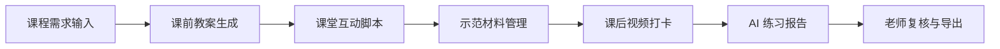
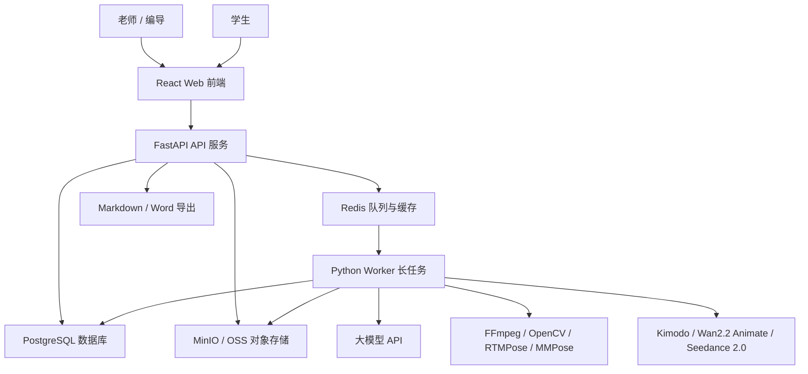
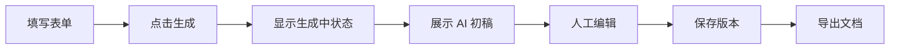
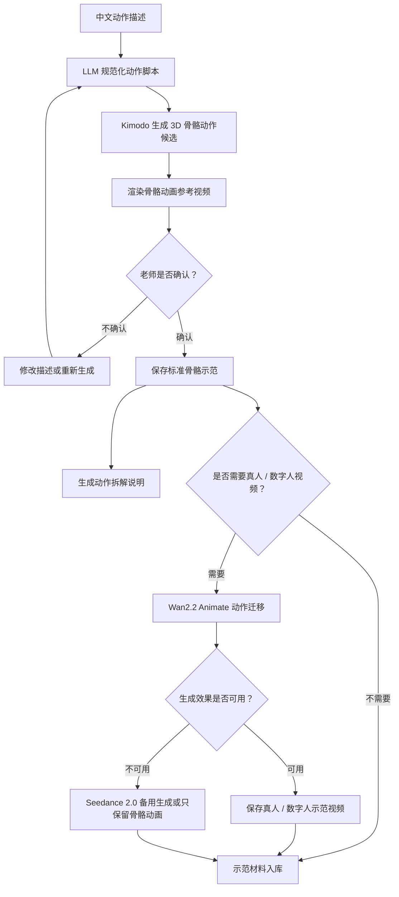
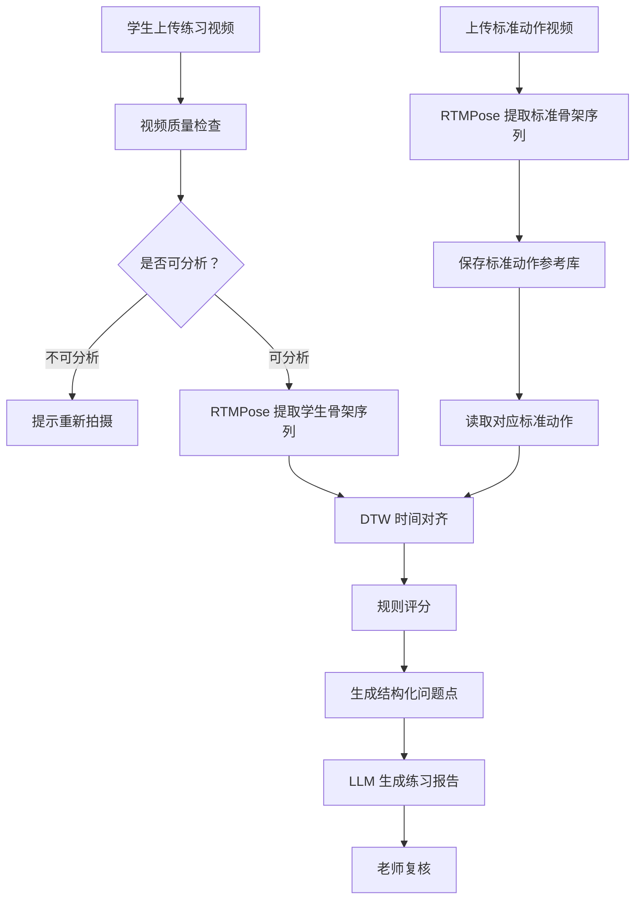

# AI 歌舞剧教学与排演辅助系统技术实现落地方案

> 面向技术组执行版本  
> 开发周期：2026 年 6 月 12 日 - 2026 年 7 月 20 日  
> 技术组配置：2 名人工智能学院研究生，具备 Java、Python、前后端开发、大模型 API 调用、Codex 辅助编程能力。本项目技术实现统一采用 Python 后端技术栈，Java 能力作为团队储备，不进入本期主架构。

## 1. 项目定位与交付目标

### 1.1 项目定位

本项目不定位为“AI 全自动完成舞蹈教学、歌舞剧创作和舞台控制”的系统，而定位为：

**AI 歌舞剧教学与排演辅助系统。**

系统的核心价值是帮助老师和团队更快完成备课、课堂互动设计、歌舞剧创编、分角色训练、课后练习反馈和排练复盘。AI 负责生成初稿、整理结构、提供建议和辅助分析，最终判断和修改仍由老师、编导或负责人完成。

这个定位更符合 2026 年 7 月 20 日前的交付周期，也更符合两人技术组的实际开发能力。

### 1.2 本次必须交付的核心闭环

本次交付建议围绕两条主线展开。

第一条是 **AI 赋能教学闭环**：



第二条是 **AI 赋能歌舞剧创编与排练闭环**：


### 1.3 本次明确不做或降级的内容

为了保证项目能在短周期内真实落地，本次必须控制边界：

| 需求 | 本次处理方式 | 原因 |
|---|---|---|
| 全自动舞蹈专业判分 | 不做 | 缺少标准动作数据、评价标准和专业标注，短期无法保证准确性 |
| 真人 / 数字人舞蹈视频生成 | 增强功能 | 核心先交付 Kimodo 骨骼动画；真人视频通过 Wan2.2 Animate 动作迁移实现，Seedance 2.0 作为备用展示方案 |
| 真实舞台灯光和追光自动控制 | 不做 | 依赖现场设备、灯光协议和舞台条件 |
| 全自动舞台合成 | 不做 | 属于综合导演系统，短期成本过高 |
| 长视频完整演出自动分析 | 降级 | 改为片段上传、人工观察记录加 AI 复盘 |
| 动作纠错 | 降级 | 改为视频打卡、RTMPose 骨架提取、DTW 对齐、规则评分和老师复核 |

### 1.4 7 月 20 日验收标准

到 2026 年 7 月 20 日，系统至少要满足以下标准：

1. 能用一个固定案例跑通完整演示，例如“客家山歌、8-12 岁、12 人、40 分钟课程、乡土美育主题”。
2. 能生成教案、课堂互动脚本、动作拆解说明、课后练习报告。
3. 能生成歌舞剧剧本结构、人物设定、分角色训练计划、歌舞融合建议。
4. 能上传短视频练习片段，并生成基础分析记录。
5. 能由老师复核 AI 输出内容，并导出 Markdown 或 Word 文档。
6. API 不稳定或网络异常时，有预置示例结果作为演示备用方案。

## 2. 技术组能力与实施策略

### 2.1 技术组能力画像

当前技术组只有两名成员，但能力覆盖比较完整：

| 能力 | 可承担工作 |
|---|---|
| Java 开发 | 团队储备能力，本期不作为主后端技术栈 |
| Python 开发 | FastAPI API 服务、Python Worker、大模型调用、视频/音频处理、脚本工具 |
| 前端开发 | React 页面、表单、上传、报告预览、导出交互 |
| AI 能力 | 大模型 API、提示词工程、结构化输出、多模态工具接入 |
| Codex | 快速生成代码、审查代码、补测试、重构提示词 |

### 2.2 总体实施策略

本项目采用 **自建 Web 系统承载核心业务流程，Python API 服务和 Python Worker 承载生成与分析能力** 的策略。

教学数据、学生上传视频、报告、权限和导出都需要稳定的数据结构和长期维护，因此本期只保留自建 Web 系统、FastAPI API 服务和 Python Worker 这条主线，避免增加部署、权限、调试和验收复杂度。

建议分工如下：

| 层级 | 工具或平台 | 定位 |
|---|---|---|
| 核心业务系统 | React + FastAPI + Python Worker | 项目主系统，保存数据，承载完整流程 |
| 大模型能力 | DeepSeek / 通义千问 / OpenAI 等 OpenAI 兼容接口 | 文本生成、结构化分析、报告生成 |
| 媒体处理 | FFmpeg + OpenCV + RTMPose / MMPose | 短视频抽帧、人体关键点提取、动作对齐与纠错 |
| AI 编程 | Codex | 需求拆解、代码生成、测试、代码审查、文档维护 |

### 2.3 两人开发分工

建议按模块固定负责人，避免两个人同时改同一批文件。

| 成员 | 主要负责 | 具体任务 |
|---|---|---|
| 林敬舒 | 待定     | 待定     |
| 李颖昌 | 待定     | 待定     |

每天至少做一次短会，确认三件事：

1. 今天要跑通哪个可演示流程。
2. 哪些需求需要降级，不继续硬做。
3. 哪些 AI 输出模板需要老师或负责人确认。

### 2.4 本机算力边界

本机配置为 RTX 3060 6G、R7 5800H、32G 内存。这个配置适合：

- 前后端开发。
- 大模型 API 调用。
- 短视频抽帧。
- RTMPose / MMPose 云端姿态点提取。
- 15-60 秒测试视频分析。

不建议在本机做：

- 长视频批量分析。
- 大模型本地训练或微调。
- 大规模视频生成。
- 批量人声分离。
- 多路视频并发推理。

如果后期需要处理长演出视频、批量学生视频或 Demucs 人声分离，建议放到云端 GPU 或服务器执行。

## 3. 系统总体架构

### 3.1 架构总览

系统采用“前端应用 + FastAPI API 服务 + Python Worker + 数据库 + 对象存储 + 异步队列”的结构。统一使用 Python 语言，但 API 服务和长任务 Worker 分进程运行，避免视频处理和模型推理阻塞 HTTP 请求。



### 3.2 为什么不采用纯前端方案

纯前端方案开发快，但无法稳定管理学生视频、账号权限、报告历史和异步任务。

因此本项目应采用自建系统承载核心流程，所有正式业务数据统一由后端和数据库管理。

### 3.3 服务拆分

| 服务 | 技术 | 职责 |
|---|---|---|
| Web 前端 | React + Vite + TypeScript | 页面展示、表单填写、上传、报告预览 |
| API 服务 | FastAPI + Python 3.11 | 登录权限、业务接口、数据落库、文件上传、导出入口 |
| Worker 服务 | Python 3.11 + Celery / RQ | 大模型调用、媒体处理、动作生成、练习纠错、AI 报告生成 |
| 数据库 | PostgreSQL | 用户、课程、剧目、提交记录、报告 |
| 缓存与队列 | Redis | 异步任务状态、短期缓存 |
| 对象存储 | MinIO，本地演示；云端可换 OSS/S3 | 视频、图片、导出文件 |

### 3.4 本地开发部署方式

本地建议使用 Docker Compose 启动基础设施：

```text
docker-compose
├── postgres
├── redis
├── minio
├── api-fastapi
├── worker-python
└── frontend-vite
```

开发时可以拆开启动：

- 前端：`npm run dev`
- FastAPI API 服务：`uvicorn app.main:app --reload`
- Python Worker：`celery -A app.worker worker -l info` 或 `rq worker`
- PostgreSQL / Redis / MinIO：Docker Compose

### 3.5 环境变量设计

建议所有密钥和外部服务地址都走环境变量。

```env
# 大模型配置
LLM_PROVIDER=deepseek
LLM_BASE_URL=https://api.deepseek.com
LLM_API_KEY=替换为真实密钥
LLM_MODEL=deepseek-chat

# 也可以切换到通义千问或 OpenAI 兼容接口
# LLM_PROVIDER=qwen
# LLM_BASE_URL=https://dashscope.aliyuncs.com/compatible-mode/v1
# LLM_MODEL=qwen-plus

# 存储配置
MINIO_ENDPOINT=http://localhost:9000
MINIO_ACCESS_KEY=minioadmin
MINIO_SECRET_KEY=minioadmin
MINIO_BUCKET=haka-music-ai

# 数据库配置
POSTGRES_HOST=localhost
POSTGRES_PORT=5432
POSTGRES_DB=haka_music_ai
POSTGRES_USER=haka
POSTGRES_PASSWORD=haka_password

# Redis 配置
REDIS_HOST=localhost
REDIS_PORT=6379
```

## 4. 前端技术栈与页面设计

### 4.1 前端技术栈

前端建议使用：

| 技术 | 用途 |
|---|---|
| React | 主前端框架 |
| Vite | 构建工具，启动快，适合短周期开发 |
| TypeScript | 提高接口和状态类型稳定性 |
| Tailwind CSS | 页面样式和响应式布局 |
| shadcn/ui | 表单、按钮、弹窗、表格、提示等基础组件 |
| React Router | 页面路由 |
| TanStack Query | API 请求、缓存、刷新和异步状态管理 |
| React Hook Form | 表单状态管理 |
| Zod | 前端表单校验，并可与后端接口 schema 对齐 |
| Markdown 渲染组件 | 展示 AI 生成报告 |

选择 React 技术栈的原因是 AI Coding 支持更成熟，组件、表单、接口请求和校验方案更容易被 Codex 稳定生成和维护。`shadcn/ui` 适合快速搭建后台型业务界面，`TanStack Query + React Hook Form + Zod` 可以把“请求状态、表单填写、字段校验、错误提示”拆得比较清楚，适合本项目大量“填写参数 -> 调用 AI -> 编辑结果 -> 保存导出”的交互。

### 4.2 页面结构

建议第一版前端包含以下页面：

| 页面 | 面向用户 | 功能 |
|---|---|---|
| 登录页 | 老师、学生、管理员 | 简单账号密码登录 |
| 工作台首页 | 老师 | 展示最近课程、最近剧目、待复核练习 |
| 教案生成页 | 老师 | 输入课程条件，生成分层教案 |
| 课堂互动页 | 老师 | 生成小游戏、口令、鼓励语、课堂脚本 |
| 示范材料页 | 老师 | 上传示范视频/图片，管理动作拆解说明 |
| 学生打卡页 | 学生 | 上传练习短视频，查看 AI 建议 |
| 练习复核页 | 老师 | 查看 AI 分析结果，补充老师点评 |
| 歌舞剧创编页 | 编导 / 老师 | 生成剧本结构、人物、台词、旁白 |
| 分角色训练页 | 编导 / 老师 | 生成主角、群演、独唱、旁白、领舞训练任务 |
| 排练复盘页 | 编导 / 老师 | 输入观察记录，生成复盘报告 |
| 导出中心 | 老师 | 导出 Markdown、Word 或演示用 PDF |

### 4.3 页面交互原则

每个 AI 生成功能都采用统一交互：



不要让 AI 结果直接变成最终结果。页面上必须保留“编辑、保存、重新生成、导出”按钮，体现 AI 辅助而不是 AI 代替老师。

### 4.4 关键组件

| 组件 | 说明 |
|---|---|
| `AiGenerateForm` | 通用 AI 生成表单组件 |
| `MarkdownPreview` | AI 报告预览组件 |
| `EditableReport` | 支持老师修改报告内容 |
| `VideoUploader` | 学生和老师上传视频 |
| `TaskStatusBadge` | 显示 AI 分析任务状态 |
| `ExportButtonGroup` | Markdown / Word 导出按钮 |
| `RoleTrainingTable` | 分角色训练计划表 |

### 4.5 前端数据校验

前端至少要校验：

- 课程时长必须大于 0。
- 年龄段不能为空。
- 舞种或主题不能为空。
- 视频上传大小需要限制，第一版建议单个视频不超过 200MB。
- 学生练习视频建议限制在 15-60 秒，避免本地处理压力过大。
- AI 生成前必须确认必要字段填写完整。

## 5. 后端技术栈与服务设计

### 5.1 后端技术栈

业务后端统一使用 Python 技术栈，API 服务和 Worker 服务共享数据模型、任务状态和提示词模板。

| 技术 | 用途 |
|---|---|
| FastAPI | 主后端框架，提供 REST API 和自动接口文档 |
| Python 3.11 | 统一后端、Worker 和 AI 能力开发语言 |
| Pydantic | 请求、响应和配置校验 |
| SQLAlchemy / SQLModel | 数据库访问和 ORM |
| Alembic | 数据库迁移 |
| JWT + Passlib | 登录鉴权和密码哈希 |
| PostgreSQL | 结构化业务数据 |
| Redis | 异步任务状态和缓存 |
| Celery / RQ | 长任务队列，用于视频处理、模型调用和报告生成 |
| MinIO Python SDK | 文件上传和下载 |
| Jinja2 | Markdown / Word 导出模板、提示词模板 |

### 5.2 权限角色

第一版建议只做三类角色：

| 角色 | 权限 |
|---|---|
| 管理员 | 用户管理、系统配置、全部数据 |
| 老师 / 编导 | 创建课程、剧目、生成报告、复核学生练习 |
| 学生 | 上传练习视频、查看自己的反馈 |

不要第一版就做复杂组织架构和班级权限，先保证演示可跑通。

### 5.3 核心数据表设计

建议核心表如下：

| 表名 | 用途 |
|---|---|
| `users` | 用户信息 |
| `courses` | 课程基础信息 |
| `lesson_plans` | 教案生成结果 |
| `class_interactions` | 课堂互动脚本 |
| `demo_assets` | 示范视频、图片、动作拆解材料 |
| `practice_submissions` | 学生练习上传记录 |
| `practice_reports` | AI 练习分析报告和老师复核意见 |
| `musical_projects` | 歌舞剧项目 |
| `musical_scripts` | 剧本结构、人物、台词 |
| `role_training_plans` | 分角色训练计划 |
| `rehearsal_reviews` | 排练复盘报告 |
| `ai_tasks` | AI 异步任务状态 |
| `export_files` | 导出文件记录 |

### 5.4 核心 API 设计

第一版建议提供以下 API：

| API | 方法 | 说明 |
|---|---|---|
| `/api/auth/login` | POST | 登录 |
| `/api/courses` | POST / GET | 创建和查询课程 |
| `/api/lesson-plans/generate` | POST | 生成教案 |
| `/api/interactions/generate` | POST | 生成课堂互动脚本 |
| `/api/demo-assets/upload` | POST | 上传示范材料 |
| `/api/practice-submissions` | POST | 学生上传练习 |
| `/api/practice-submissions/{id}/analyze` | POST | 触发练习分析 |
| `/api/practice-reports/{id}/review` | PUT | 老师复核报告 |
| `/api/musical-projects` | POST / GET | 创建和查询剧目 |
| `/api/musical-scripts/generate` | POST | 生成剧本结构 |
| `/api/role-training/generate` | POST | 生成分角色训练计划 |
| `/api/rehearsal-reviews/generate` | POST | 生成排练复盘 |
| `/api/exports/{type}/{id}` | GET | 导出 Markdown 或 Word |

### 5.5 异步任务设计

视频上传、关键帧抽取、姿态点分析、大模型报告生成不应该阻塞前端请求。建议使用异步任务。

任务状态统一为：

| 状态 | 含义 |
|---|---|
| `PENDING` | 已创建，等待执行 |
| `RUNNING` | 正在处理 |
| `SUCCESS` | 处理成功 |
| `FAILED` | 处理失败 |
| `CANCELLED` | 已取消 |

前端通过轮询 `/api/ai-tasks/{taskId}` 获取进度。API 服务只负责任务创建和状态查询，真正耗时的视频处理、姿态提取、动作生成和报告生成由 Python Worker 执行。

### 5.6 导出设计

导出分两类：

1. Markdown：后端直接根据模板拼接，便于继续编辑。
2. Word：后端使用 Python 文档生成库生成 `.docx`。

第一版优先实现 Markdown。Word 可以在 7 月中旬作为增强功能补上。

## 6. AI 能力实现方案

### 6.1 AI 能力技术栈

AI 能力由统一 Python 技术栈承载。FastAPI API 服务负责接收请求、创建任务和返回结果；Python Worker 负责执行大模型调用、视频处理、姿态估计、动作生成和报告生成。

| 技术 | 用途 |
|---|---|
| FastAPI | 对前端提供 AI 生成和分析相关 API |
| Pydantic | 请求和响应结构校验 |
| OpenAI-compatible SDK | 统一调用 DeepSeek、通义千问、OpenAI |
| Celery / RQ | 调度视频分析、动作生成、报告生成等长任务 |
| FFmpeg | 视频抽帧、音频裁剪、变速 |
| OpenCV | 视频帧读取和基础图像处理 |
| RTMPose / MMPose | 人体关键点提取和骨架序列生成 |
| DTW | 标准动作和学生动作的时间对齐 |
| Jinja2 | 提示词模板渲染 |

### 6.2 大模型调用策略

建议封装统一的 `LLMClient`，业务代码不要直接绑定某个厂商。

```text
业务功能
  -> PromptTemplate
  -> LLMClient
  -> DeepSeek / 通义千问 / OpenAI
  -> JSON Response
  -> 结构化校验
  -> 保存到数据库
```

第一版模型选择建议：

| 场景 | 推荐模型类型 |
|---|---|
| 教案、互动脚本、剧本、复盘报告 | 通用文本生成模型 |
| JSON 结构化输出 | 支持稳定指令跟随的文本模型 |
| 课后练习视频纠错 | RTMPose / MMPose 提取骨架，DTW 做动作对齐，规则评分生成结构化问题点 |
| 文本生成骨骼动作 | Kimodo，云端运行，用于生成 3D 骨骼动画 |
| 真人 / 数字人示范视频 | Wan2.2 Animate，基于 Kimodo 骨骼参考视频做动作迁移 |
| 课件展示型视频备用方案 | Seedance 2.0，用于快速生成真人风格视频，不作为标准动作复刻依据 |
| 语音合成 | 可选增强，不作为核心交付 |

### 6.3 提示词模板管理

提示词不要散落在代码里。建议按功能放在后端项目的 `prompts/` 目录：

```text
prompts
├── lesson_plan.md
├── class_interaction.md
├── action_breakdown.md
├── motion_script.md
├── digital_human_video.md
├── practice_report.md
├── musical_script.md
├── role_training.md
├── dance_music_fusion.md
└── rehearsal_review.md
```

每个提示词都要求模型返回 JSON，方便后端解析和前端渲染。

示例输出结构：

```json
{
  "title": "客家山歌主题少儿舞蹈课教案",
  "teachingGoals": ["理解客家山歌文化背景", "掌握基础律动"],
  "classFlow": [
    {
      "stage": "热身",
      "durationMinutes": 8,
      "content": "肩颈、腰胯、膝踝基础热身",
      "teacherTips": "提醒学生保持身体放松"
    }
  ],
  "keyPoints": ["节奏稳定", "队形间距"],
  "commonMistakes": ["动作抢拍", "队形散乱"],
  "homework": ["跟随音乐完成 30 秒律动练习并上传视频"]
}
```

### 6.4 动作示范生成链路

动作示范生成采用 **Kimodo 骨骼动画为主、Wan2.2 Animate 真人 / 数字人视频为增强、Seedance 2.0 为备用** 的方案。

核心原因：

- Kimodo 更适合作为动作生成主链路，负责从文本生成 3D 骨骼动作。
- Wan2.2 Animate 更适合把已确认的动作参考视频迁移到真人或数字人形象上。
- Seedance 2.0 适合快速生成真人风格课件视频，但动作复刻不如动作迁移方案稳定。
- 团队没有动捕设备，也不使用 Unity 等专业动画引擎，因此不做复杂动作绑定和专业动画编辑。

处理流程：



最小可交付版本：

1. 老师输入动作名称、动作描述、节拍和教学提示。
2. Python Worker 使用 `motion_script.md` 把中文描述改写为 Kimodo 可用的英文动作 prompt。
3. 云端运行 Kimodo，生成 2-3 个骨骼动作候选。
4. 后端把候选动作渲染为 MP4 或 GIF 预览。
5. 前端提供候选预览、重新生成和确认按钮。
6. 老师确认后，系统保存骨骼动画、动作脚本和动作拆解说明。

增强版本：

1. 用户上传或选择一张真人 / 数字人形象图。
2. 系统把老师确认的 Kimodo 骨骼动画渲染为动作参考视频。
3. 云端调用 Wan2.2 Animate，生成真人 / 数字人风格示范视频。
4. 如果 Wan2.2 Animate 部署或效果不稳定，使用 Seedance 2.0 生成课件展示型视频。

验收口径：

- 核心验收只要求“文本 -> Kimodo -> 骨骼动画 -> 老师确认 -> 入库”跑通。
- 真人 / 数字人视频属于增强能力，不阻塞主线交付。
- 所有动作结果必须经过老师确认后才能标记为“示范材料”。

### 6.5 课后练习视频纠错

课后练习纠错采用 **RTMPose + DTW 动作对齐 + 规则评分 + LLM 生成报告** 的方案。LLM 不直接判断视频动作对错，只负责把结构化分析结果整理成学生能理解的练习建议。

该功能需要先建立少量标准动作参考库。标准动作视频由舞蹈专业学生或老师提供，每个动作建议 1-3 条，单条 10-30 秒，正面全身入镜，固定机位，按 4 拍或 8 拍完成。系统会从标准动作视频中提取骨架序列，作为学生练习视频的参考对象。

处理流程：



标准动作参考库要求：

| 项目 | 建议 |
|---|---|
| 每个动作视频数量 | 1-3 条 |
| 单条视频时长 | 10-30 秒 |
| 拍摄角度 | 正面优先，可补充侧面 |
| 画面要求 | 全身入镜，手脚不要出画 |
| 镜头要求 | 固定机位，不要手持晃动 |
| 节拍要求 | 4 拍或 8 拍，开头静止 1-2 秒 |
| 文件命名 | `动作名_视角_节拍_版本号.mp4` |

分析指标包括：

- 视频时长。
- 是否能检测到人体。
- 人体是否大部分时间在画面中。
- 是否存在明显画面遮挡或过暗。
- RTMPose 关键点检测置信度。
- 学生动作与标准动作的 DTW 对齐结果。
- 手臂高度差异。
- 肘部、肩部、膝部等关键关节角度差异。
- 身体重心左右晃动。
- 转身或动作完成节奏偏差。
- 左右对称性差异。

规则评分示例：

| 指标 | 判断方式 | 输出示例 |
|---|---|---|
| 手臂高度 | 比较手腕 / 肘部相对肩线的位置 | 第 3-4 拍手臂高度低于参考动作 |
| 节奏偏差 | DTW 对齐后比较关键动作阶段耗时 | 转身完成时间比参考动作慢 |
| 重心稳定 | 比较髋部中心点横向波动 | 重心左右晃动较明显 |
| 左右对称 | 比较左右肩、肘、腕关键点差异 | 左右手打开幅度不一致 |
| 拍摄质量 | 检查全身入镜和关键点置信度 | 下半身出画，建议重新拍摄 |

AI 报告不要写成“动作正确率 95%”这类不可靠结论，而写成：

- “第 3-4 拍手臂打开高度低于参考动作，建议抬到肩线附近。”
- “转身完成时间偏慢，可以先放慢音乐练习，再逐步恢复原速。”
- “视频中脚部多次出画，建议下次拍摄时手机后退一点，保持全身入镜。”

如果没有标准动作视频，系统只能输出基础观察，不能进行标准动作对比。该情况下报告必须明确提示“缺少标准动作参考，本次仅提供拍摄质量和动作幅度观察”。

### 6.6 音频处理增强

如果时间允许，可加入简单音频工具：

| 功能 | 实现方式 |
|---|---|
| 片段裁剪 | FFmpeg 按开始和结束时间裁剪 |
| 慢速排练版 | FFmpeg `atempo` 调整速度 |
| 音量统一 | FFmpeg loudness normalize |
| 原唱 / 伴奏分离 | 可选 Demucs，建议云端执行 |

本机 RTX 3060 6G 不建议批量跑人声分离。演示阶段可以准备少量样例音频，提前离线处理。

### 6.7 Codex 使用方式

Codex 作为统一的 AI 开发工具，用于辅助技术组完成需求拆解、代码实现、测试补全、代码审查、提示词迭代和文档维护。Codex 只参与开发过程，不作为系统运行时依赖。

建议使用方式：

| 使用场景 | Codex 用法 |
|---|---|
| 需求拆解 | 根据需求文档拆分前端页面、后端接口、Worker 任务和验收点 |
| 代码实现 | 按模块生成或修改 React、FastAPI、Python Worker 代码 |
| 提示词迭代 | 维护教案生成、剧本生成、动作脚本、练习报告等提示词模板 |
| 测试补全 | 补充接口测试、AI mock 测试和关键流程验证脚本 |
| 代码审查 | 检查业务逻辑、异常处理、权限边界和文档同步情况 |
| 文档维护 | 在需求、技术方案和接口说明变化时同步更新 Markdown 文档 |

仓库中建议保留 `AGENTS.md`，写明：

- 代码注释优先使用中文。
- 不在本机跑超过 RTX 3060 6G / 32G 内存能力的全量任务。
- 修改功能后要补充对应文档或接口说明。
- AI 生成结果必须经过结构化校验。

### 6.8 参考技术资料

实现时优先查阅官方文档：

- DeepSeek API 文档：<https://api-docs.deepseek.com/>
- 阿里云百炼 OpenAI 兼容接口：<https://help.aliyun.com/zh/model-studio/developer-reference/compatibility-of-openai-with-dashscope>
- OpenAI API 文档：<https://platform.openai.com/docs>
- FastAPI 文档：<https://fastapi.tiangolo.com/>
- MMPose 文档：<https://mmpose.readthedocs.io/>
- RTMPose 论文：<https://arxiv.org/abs/2303.07399>
- MediaPipe Pose Landmarker 文档：<https://ai.google.dev/edge/mediapipe/solutions/vision/pose_landmarker>，仅作为轻量备用方案参考
- FFmpeg 文档：<https://ffmpeg.org/documentation.html>
- Kimodo GitHub：<https://github.com/nv-tlabs/kimodo>
- Wan2.2 GitHub：<https://github.com/Wan-Video/Wan2.2>
- Wan-Animate 项目页：<https://humanaigc.github.io/wan-animate/>
- ComfyUI Wan2.2 Animate 工作流：<https://docs.comfy.org/tutorials/video/wan/wan2-2-animate>
- Seedance 2.0：<https://seed.bytedance.com/en/seedance2_0>

## 7. 各需求模块落地路径

### 7.1 课前教案生成

输入字段：

| 字段 | 示例 |
|---|---|
| 舞种 / 主题 | 客家山歌主题舞蹈 |
| 年龄段 | 8-12 岁 |
| 学生人数 | 12 人 |
| 课时时长 | 40 分钟 |
| 学员基础 | 零基础 / 有基础 |
| 教学目标 | 了解客家文化，掌握基础律动 |

输出内容：

- 教学目标。
- 热身安排。
- 动作拆解。
- 课堂流程。
- 重难点。
- 易错点。
- 课堂互动。
- 课后练习任务。

实现方式：

1. 前端表单收集参数。
2. 后端保存课程信息。
3. API 服务创建教案生成任务。
4. Python Worker 使用 `lesson_plan.md` 提示词生成 JSON。
5. 后端校验 JSON 并落库。
6. 前端展示可编辑教案。
7. 支持 Markdown 导出。

### 7.2 课堂互动与口令脚本

输入字段：

- 课程主题。
- 年龄段。
- 教学环节。
- 课堂氛围要求。
- 是否需要游戏化。

输出内容：

- 开场互动话术。
- 律动小游戏。
- 口令脚本。
- 鼓励语。
- 课堂收尾话术。

实现方式：

课堂互动脚本可以复用教案上下文，也可以单独生成。前端要支持“一键带入当前教案信息”，减少老师重复输入。

### 7.3 示范材料管理

输入内容：

- 动作名称。
- 动作文字描述。
- 动作节拍和方向提示。
- 难度要求。
- 适用课程。
- 可选真人 / 数字人形象图。
- 可选老师参考视频。

输出内容：

- Kimodo 生成的骨骼动画候选。
- 老师确认的标准骨骼动画。
- 动作拆解说明。
- 节拍提示、重难点和易错点。
- 可选 Wan2.2 Animate 真人 / 数字人示范视频。
- 可选 Seedance 2.0 课件展示型视频。

实现方式：

1. 老师新建动作示范材料，填写动作名称、文字描述、节拍和教学提示。
2. 后端创建示范材料记录，并创建异步动作生成任务。
3. Python Worker 调用大模型，把中文动作描述规范化为 Kimodo 可用的动作 prompt。
4. 云端运行 Kimodo，生成 2-3 个 3D 骨骼动作候选。
5. 系统将 Kimodo 输出渲染成 MP4 或 GIF 骨骼动画预览。
6. 老师在前端挑选一个候选版本；如果不满意，可以修改动作描述后重新生成。
7. 老师确认后，系统保存标准骨骼动画，并生成动作拆解说明、节拍提示、重难点和易错点。
8. 如果老师需要真人 / 数字人视频，系统使用确认后的骨骼动画参考视频和人物形象图，调用 Wan2.2 Animate 做动作迁移。
9. 如果 Wan2.2 Animate 部署成本过高或生成效果不可用，Seedance 2.0 作为备用方案生成课件展示型视频。
10. 最终示范材料入库，可被教案、课堂互动脚本或剧目片段引用。

第一版核心目标是跑通“文本动作描述 -> Kimodo 骨骼动画 -> 老师确认 -> 入库”。真人 / 数字人视频是增强能力，不作为核心交付阻塞项。

### 7.4 课后视频打卡和练习报告

学生端流程：

1. 选择课程或作业。
2. 上传 15-60 秒练习视频。
3. 等待系统分析。
4. 查看 AI 建议和老师点评。

老师端流程：

1. 查看学生提交列表。
2. 查看关键帧和基础分析。
3. 修改 AI 报告。
4. 给出最终点评。

AI 报告结构：

- 视频基本信息。
- 画面可观察情况。
- 节奏与完整度观察。
- 姿态和动作稳定性观察。
- 建议老师复核的点。
- 学生下一次练习任务。

注意：报告中不出现“系统判定动作正确率 95%”这类不可靠表述。

### 7.5 歌舞剧剧本生成

输入字段：

| 字段 | 示例 |
|---|---|
| 主题 | 客家文化、乡土美育 |
| 演出时长 | 10 分钟 |
| 演员人数 | 12 人 |
| 年龄段 | 小学生 |
| 风格 | 温暖、活泼、有教育意义 |

输出内容：

- 剧名建议。
- 分幕剧情大纲。
- 人物设定。
- 台词和旁白。
- 情绪基调。
- 舞蹈、独唱、群舞留白段落。

实现方式：

剧本生成作为独立模块，不和教案混在一起。生成后可继续调用分角色训练计划和歌舞融合建议。

### 7.6 分角色训练计划

输入内容：

- 剧本结构。
- 人物列表。
- 演员年龄。
- 排练周期。

输出内容：

- 主角训练任务。
- 配角训练任务。
- 群演训练任务。
- 独唱训练任务。
- 旁白训练任务。
- 领舞训练任务。
- 每日排练重点。

实现方式：

API 服务读取剧本结构并创建生成任务，Python Worker 生成角色训练表。前端用表格展示，每个角色一行，支持老师修改。

### 7.7 歌舞融合建议

输入内容：

- 剧本段落。
- 音乐名称或歌词。
- 表演人数。
- 舞台空间描述。

输出内容：

- 哪些地方适合边唱边跳。
- 哪些地方适合独白加慢动作。
- 哪些地方适合群舞高潮。
- 哪些地方适合间奏舞蹈。
- 每段情绪和动作建议。

实现方式：

第一版不做自动编舞，只输出结构化建议表，由编导老师确认。

### 7.8 排练复盘报告

输入内容：

- 老师观察记录。
- 排练日期。
- 剧目名称。
- 今日排练内容。
- 存在问题。
- 下一次排练目标。

输出内容：

- 今日排练总结。
- 主要问题归类。
- 角色层面的改进建议。
- 队形和节奏层面的建议。
- 下一次排练计划。
- 可用于结题或教研材料的文字。

实现方式：

复盘报告不要依赖长视频自动理解，优先依赖老师观察记录。AI 负责把零散记录整理成规范报告。

## 8. 6 月 12 日到 7 月 20 日开发计划

### 8.1 总体节奏

开发节奏按“先主干、再增强、最后演示打磨”执行。

| 阶段 | 日期 | 重点 |
|---|---|---|
| 阶段一 | 6 月 12 日 - 6 月 15 日 | 需求冻结、架构搭建、项目骨架 |
| 阶段二 | 6 月 16 日 - 6 月 24 日 | 教案生成、课堂互动、示范材料管理 |
| 阶段三 | 6 月 25 日 - 7 月 3 日 | 视频打卡、基础姿态分析、练习报告 |
| 阶段四 | 7 月 4 日 - 7 月 10 日 | 歌舞剧剧本、分角色训练、歌舞融合建议 |
| 阶段五 | 7 月 11 日 - 7 月 16 日 | 复盘报告、系统联调、演示数据和文档打磨 |
| 阶段六 | 7 月 17 日 - 7 月 20 日 | 演示材料、彩排、最终交付 |

### 8.2 详细排期

| 日期 | 成员 A：后端与 AI Worker | 成员 B：前端与演示 | 当日交付 |
|---|---|---|---|
| 6 月 12 日 | 确认技术架构、初始化 FastAPI API 和 Worker 目录 | 画页面草图、确认功能菜单 | MVP 范围和页面结构确定 |
| 6 月 13 日 | 搭建 FastAPI、PostgreSQL、Redis、MinIO | 搭建 React、路由、布局、登录页 | 前后端骨架可启动 |
| 6 月 14 日 | 设计核心表和基础 API | 完成工作台、基础表单组件 | 数据模型和基础页面完成 |
| 6 月 15 日 | 打通前后端请求和文件上传 | 完成上传组件和接口封装 | 系统主干跑通 |
| 6 月 16 日 | 实现 Worker LLMClient | 实现教案生成表单 | 教案生成接口初版 |
| 6 月 17 日 | 编写教案提示词和 JSON 校验 | 完成教案预览和编辑 | 教案生成可用 |
| 6 月 18 日 | 教案保存和查询接口 | 完成教案列表和详情页 | 教案模块闭环 |
| 6 月 19 日 | 课堂互动生成接口 | 课堂互动页面 | 互动脚本可生成 |
| 6 月 20 日 | 动作拆解提示词 | 示范材料上传页面 | 示范材料可上传 |
| 6 月 21 日 | FFmpeg 抽帧接口 | 关键帧展示组件 | 示范视频可抽帧 |
| 6 月 22 日 | Markdown 导出接口 | 导出按钮和预览 | 教案和互动脚本可导出 |
| 6 月 23 日 | 修复教学闭环问题 | 优化教学流程体验 | 教学主线第一版可演示 |
| 6 月 24 日 | 准备教学示例数据 | 准备演示页面截图 | 第一轮内部演示 |
| 6 月 25 日 | 学生提交表和上传接口 | 学生打卡页 | 练习视频可上传 |
| 6 月 26 日 | AI 异步任务表和状态接口 | 任务状态展示 | 视频分析任务可追踪 |
| 6 月 27 日 | FFmpeg 视频基础信息提取 | 视频详情页 | 视频元数据可展示 |
| 6 月 28 日 | RTMPose 姿态点提取初版 | 姿态分析结果展示 | 短视频骨架序列可提取 |
| 6 月 29 日 | 练习报告提示词 | 报告预览和编辑 | AI 练习报告初版 |
| 6 月 30 日 | 老师复核接口 | 老师复核页 | 老师点评可保存 |
| 7 月 1 日 | 练习报告导出 | 报告导出按钮 | 练习报告可导出 |
| 7 月 2 日 | 处理异常视频和失败状态 | 上传限制和错误提示 | 视频打卡更稳定 |
| 7 月 3 日 | 准备练习打卡演示样例 | 联调学生端和老师端 | 课后练习闭环可演示 |
| 7 月 4 日 | 歌舞剧项目表和 API | 歌舞剧创编页 | 剧目项目可创建 |
| 7 月 5 日 | 剧本生成提示词和接口 | 剧本预览页面 | 剧本结构可生成 |
| 7 月 6 日 | 人物与台词生成结构优化 | 剧本编辑交互 | 剧本可编辑保存 |
| 7 月 7 日 | 分角色训练接口 | 分角色训练表格 | 角色训练计划可生成 |
| 7 月 8 日 | 训练计划保存和导出 | 训练卡片页面 | 角色训练可导出 |
| 7 月 9 日 | 歌舞融合建议接口 | 歌舞融合建议页面 | 唱跳衔接建议可生成 |
| 7 月 10 日 | 歌舞剧模块联调 | 优化歌舞剧流程 | 歌舞剧主线可演示 |
| 7 月 11 日 | 复盘报告接口 | 复盘报告页面 | 复盘报告可生成 |
| 7 月 12 日 | 复盘报告导出 | 复盘编辑体验优化 | 复盘模块完成 |
| 7 月 13 日 | 补充演示用固定案例数据 | 完善演示页面和示例报告 | 演示案例数据完整 |
| 7 月 14 日 | 联调导出、权限和异常兜底 | 优化页面细节和操作路径 | 演示流程更稳定 |
| 7 月 15 日 | 修复全流程接口问题 | 修复页面体验问题 | 两条主线联调完成 |
| 7 月 16 日 | 冻结功能，不再加新需求 | 准备演示脚本和截图 | 交付候选版本 |
| 7 月 17 日 | 准备备用静态数据 | 准备演示账号和样例 | 演示材料完整 |
| 7 月 18 日 | 全流程彩排和问题修复 | 全流程彩排和问题修复 | 第一轮彩排通过 |
| 7 月 19 日 | 只修阻塞 bug | 只修阻塞 bug | 最终版本冻结 |
| 7 月 20 日 | 现场技术支持 | 现场演示支持 | 最终交付 |

### 8.3 每周验收点

| 时间 | 验收标准 |
|---|---|
| 6 月 15 日 | 项目骨架能启动，前后端能互通 |
| 6 月 24 日 | 教案、互动、示范材料三件事能跑通 |
| 7 月 3 日 | 学生视频打卡和练习报告能跑通 |
| 7 月 10 日 | 歌舞剧创编和分角色训练能跑通 |
| 7 月 16 日 | 系统进入冻结，准备最终演示材料 |
| 7 月 20 日 | 完成交付演示 |

### 8.4 风险与兜底方案

| 风险 | 兜底方案 |
|---|---|
| 大模型 API 不稳定 | 准备本地示例 JSON，演示时可切换 mock 模式 |
| 视频分析效果一般 | 明确说明是辅助观察，不做专业判分 |
| 时间不够 | 优先保教案、互动、剧本、训练计划、复盘报告，视频分析可简化 |
| 前后端联调耗时 | 所有 API 先用 OpenAPI 文档和 mock 数据约定 |
| 本机算力不足 | 长视频、批量视频、人声分离统一放到云端或预处理 |

### 8.5 最终交付物清单

到 7 月 20 日，建议交付：

1. 可运行的 Web 系统。
2. 前端、FastAPI API 服务、Python Worker 源码。
3. Docker Compose 本地启动配置。
4. 示例账号。
5. 示例课程和歌舞剧项目数据。
6. 示例学生练习视频和分析报告。
7. Markdown / Word 导出样例。
8. 系统演示脚本和备用截图。

### 8.6 一句话总结

本项目的正确落地方向不是追求“AI 全自动替代老师和编导”，而是用可控的 Web 系统、大模型 API、轻量媒体处理和人工复核流程，把备课、创编、排练和复盘中最耗时间的文字整理、结构规划、材料沉淀工作先做起来。
