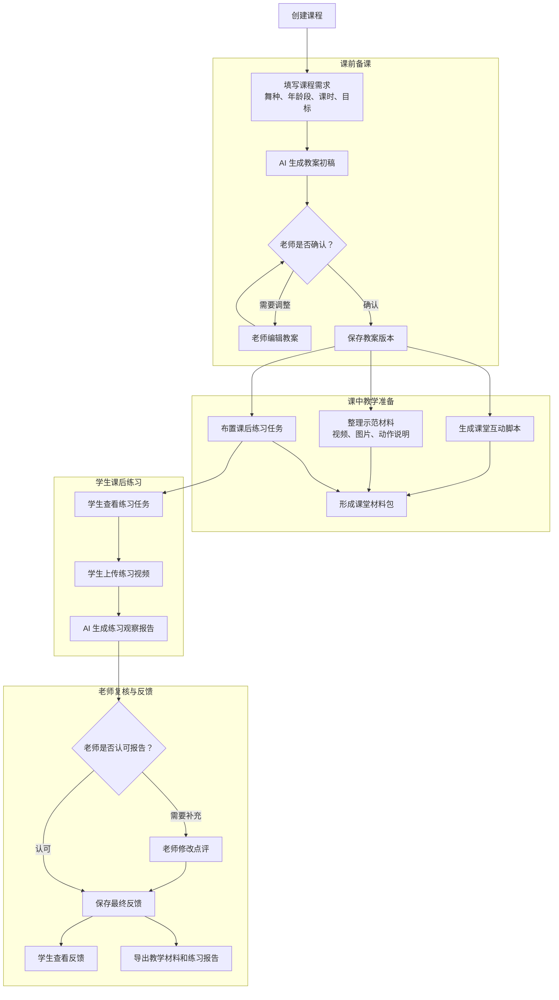
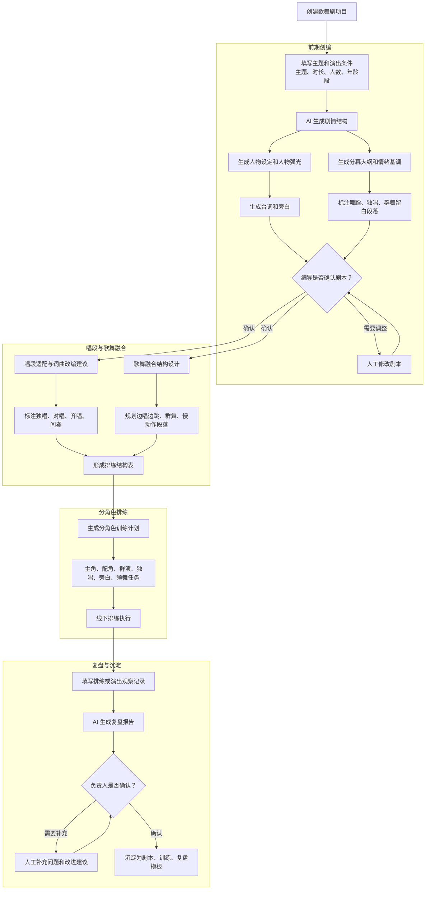
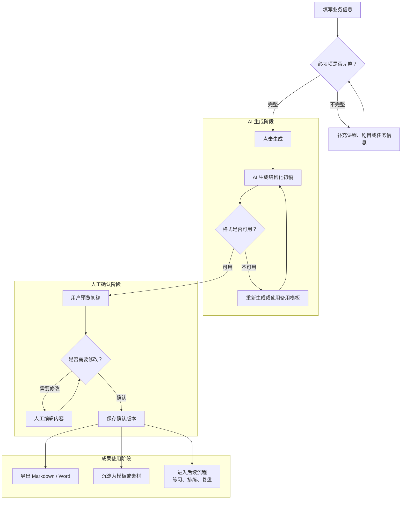
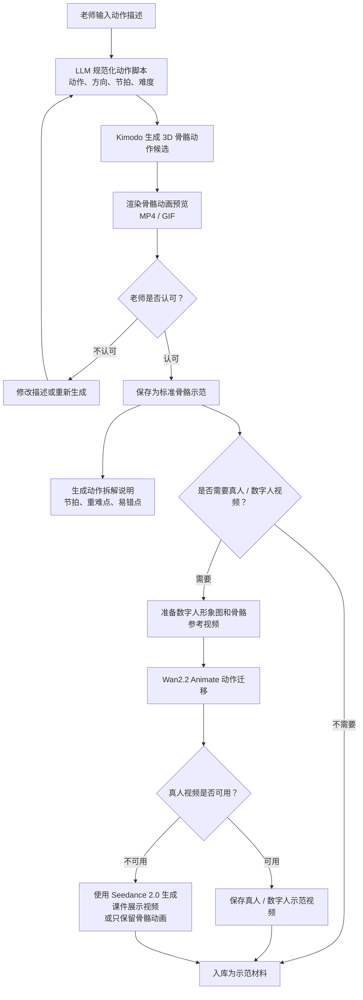
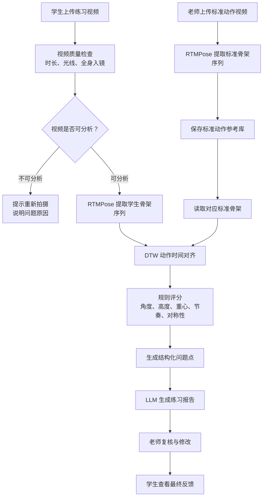

# AI 歌舞剧教学与排演辅助系统需求细化文档

> 本文档基于《初步教学设想.docx》整理。  
> 文档定位：需求细化与业务流程说明。  
> 区别说明：本文档重点讲“要做什么、谁来用、怎么流转、输出什么”，不展开具体技术选型；技术实现细节见《AI歌舞剧教学与排演辅助系统-技术实现落地方案.md》。

## 1. 项目背景与目标

### 1.1 背景

三下乡团队希望把 AI 引入歌舞剧教学、创编、排练和复盘过程，用 AI 降低老师备课、学生练习、节目创作和排演总结的工作量。

原始设想中包含两大方向：

1. AI 赋能教学：课前备课、课中互动、课后练习。
2. AI 赋能歌舞剧：前期创编、分角色教学、演出复盘。舞台合成方向已和负责人沟通，因依赖现场设备，暂时 PASS，不纳入本期交付。

本系统的目标不是让 AI 完全替代老师、编导和舞美人员，而是让 AI 成为辅助工具：先生成初稿、整理流程、给出建议，再由人确认、修改和落地。

### 1.2 系统目标

系统需要解决以下问题：

| 问题 | 系统目标 |
|---|---|
| 老师备课时间长 | 通过表单输入快速生成标准化教案 |
| 不同年龄、基础的学生教学内容难适配 | 自动生成不同层级、不同难度版本 |
| 课堂互动和口令需要临时想 | 生成课堂小游戏、律动脚本、鼓励话术 |
| 学生课后练习缺少反馈 | 支持视频打卡、基础观察报告和老师复核 |
| 歌舞剧创编从零开始难度大 | 生成剧本结构、人物设定、台词和旁白初稿 |
| 角色类型复杂，训练任务不同 | 按主角、配角、群演、独唱、旁白、领舞分层生成训练计划 |
| 排练过程难沉淀 | 生成排练复盘报告和可复用模板 |

### 1.3 需求落地原则

1. 所有 AI 结果默认是“初稿”，必须允许人工修改。
2. 教学、创编、复盘类内容优先落地，舞台控制和专业动作判分暂不作为核心能力。
3. 每个功能都要形成可保存、可复用、可导出的成果。
4. 系统流程要适合老师和学生使用，不能只服务技术演示。
5. 对视频、动作、舞台等复杂需求，先做“辅助观察”和“建议生成”，不承诺全自动准确判断。

## 2. 用户角色

### 2.1 老师

老师是教学侧核心用户，主要使用：

- 教案生成。
- 课堂互动脚本。
- 示范材料管理。
- 学生练习复核。
- 教学复盘和导出。

### 2.2 编导 / 负责人

编导或项目负责人是歌舞剧侧核心用户，主要使用：

- 剧本结构生成。
- 人物和台词生成。
- 唱段适配建议。
- 歌舞融合设计。
- 分角色训练计划。
- 排练复盘报告。

### 2.3 学生 / 学员

学生主要使用：

- 查看老师布置的练习任务。
- 上传课后练习视频。
- 查看 AI 初步建议和老师最终点评。

### 2.4 管理员

管理员主要负责：

- 维护账号。
- 维护课程和剧目基础数据。
- 管理示例素材。
- 配置演示数据。

## 3. 总体业务流程

### 3.1 教学业务总流程

### 3.2 歌舞剧业务总流程

### 3.3 通用 AI 生成流程

系统中所有 AI 生成类功能采用同一套用户体验：

AI 输出不能直接覆盖人工确认结果。每次生成和修改都应保留记录，方便回溯。

## 4. 教学侧需求细化

## 4.1 需求 T01：教案生成

### 需求来源

《初步教学设想.docx》中提出：输入舞种、年龄段、课时、教学目标，AI 生成分层教案、动作拆解步骤、课堂流程、热身 / 放松方案，并自动标注重难点、易错点。

### 使用对象

老师。

### 业务目标

帮助老师快速生成一份可上课、可修改、可导出的舞蹈教学教案，减少从零备课的时间。

### 输入内容

| 输入项 | 是否必填 | 示例 |
|---|---|---|
| 课程名称 | 必填 | 客家山歌主题舞蹈体验课 |
| 舞种 / 课程类型 | 必填 | 民族舞、少儿律动、歌舞剧片段 |
| 年龄段 | 必填 | 8-12 岁 |
| 学生人数 | 必填 | 12 人 |
| 学员基础 | 必填 | 零基础、有基础、混合水平 |
| 课时时长 | 必填 | 40 分钟 |
| 教学目标 | 必填 | 掌握基础律动，了解客家文化 |
| 课程风格 | 选填 | 活泼、温暖、红色主题、乡土美育 |
| 注意事项 | 选填 | 学生年龄偏小，动作不能太难 |

### 处理流程（如后续恢复时）

1. 老师进入“教案生成”页面。
2. 老师填写课程基本信息。
3. 系统检查必填项是否完整。
4. 老师点击“生成教案”。
5. AI 根据输入生成教案初稿。
6. 系统展示教案内容，老师可以逐段修改。
7. 老师点击“保存”，系统保存当前版本。
8. 老师可以导出 Markdown 或 Word。

### 输出内容（如后续恢复时）

教案需要包含：

| 输出模块 | 内容 |
|---|---|
| 课程概况 | 课程名称、年龄段、人数、时长、主题 |
| 教学目标 | 知识目标、能力目标、情感目标 |
| 课堂流程 | 热身、导入、动作学习、组合练习、展示、放松 |
| 动作拆解 | 每个关键动作的步骤、节奏、老师提示 |
| 分层建议 | 零基础学生做什么，有基础学生增加什么 |
| 重难点 | 本节课最需要注意的教学点 |
| 易错点 | 学生容易出现的问题 |
| 纠正方法 | 针对易错点给出老师提示 |
| 课后任务 | 学生回家练习内容 |

### 验收标准

1. 老师填写一组课程信息后，系统能生成完整教案。
2. 教案内容必须分段清晰，不能只有一整段文字。
3. 教案中必须包含热身、主体教学、放松和课后任务。
4. 老师可以修改 AI 生成内容。
5. 保存后再次进入页面，内容不能丢失。
6. 至少支持 Markdown 导出。

### 边界说明

教案生成只负责文本和流程建议，不保证自动生成的动作完全符合专业编舞要求。最终内容需要老师确认。

## 4.2 需求 T02：多版本教案与重难点标注

### 需求来源

《初步教学设想.docx》中提出：提示词明确课程风格、课程内容和学员基础，一键生成多版本教案，自动标注重难点、易错点。

### 使用对象

老师。

### 业务目标

在同一课程主题下，快速生成适合不同班级、不同基础学生的教案版本。

### 输入内容

| 输入项 | 示例 |
|---|---|
| 原始教案 | 已生成的一版教案 |
| 版本类型 | 低龄版、基础版、进阶版、演出版 |
| 调整方向 | 降低动作难度、增加队形变化、增强课堂趣味 |

### 处理流程

1. 老师在已有教案中点击“生成变体版本”。
2. 老师选择版本类型。
3. 系统基于原教案生成新版本。
4. 系统自动标出新版本的重难点和易错点。
5. 老师对比原版本和新版本。
6. 老师保存需要使用的版本。

### 输出内容

- 新版本教案。
- 与原版本相比的调整说明。
- 新版本重难点。
- 新版本易错点。
- 适用班级或学员类型。

### 验收标准

1. 同一课程至少可以生成 2 种不同版本。
2. 不同版本之间应体现难度、时长或教学重点差异。
3. 每个版本都能独立保存和导出。

### 边界说明

第一版不需要做复杂版本管理，只要能在同一课程下保存多个教案版本即可。

## 4.3 需求 T03：示范视频 / 动作图解制作

### 需求来源

《初步教学设想.docx》中提出：文字描述动作，AI 生成人体骨骼动画或真人风格示范视频，用于课件或示范。

### 使用对象

老师。

### 业务目标

帮助老师把文字动作描述转成可观看、可挑选、可复用的动作示范材料。系统优先生成 **人体骨骼动画**，用于动作拆解和教学说明；在骨骼动作经老师确认后，再可选生成真人或数字人风格示范视频，用于课件展示。

本需求采用“动作准确性优先，真人画面效果其次”的原则。标准动作依据以老师确认后的骨骼动画和动作拆解说明为准，真人风格视频主要用于辅助展示。

### 输入内容

| 输入项 | 是否必填 | 示例 |
|---|---|---|
| 动作名称 | 必填 | 双手打开转身 |
| 动作描述 | 必填 | 双手从胸前打开，同时向右转身一圈 |
| 适用课程 | 选填 | 客家山歌主题舞蹈体验课 |
| 动作节拍 | 选填 | 4 拍完成，前 2 拍打开双手，后 2 拍转身 |
| 身体方向 | 选填 | 面向正前方开始，向右转身 |
| 难度要求 | 选填 | 适合 8-12 岁零基础学生 |
| 数字人形象图 | 选填 | 用于生成真人 / 数字人风格视频 |
| 老师参考视频 | 选填 | 老师自己录制的动作参考短视频 |
| 教学提示 | 选填 | 注意重心稳定 |

### 处理流程

具体步骤：

1. 老师进入“示范材料”页面。
2. 老师新建动作条目，填写动作名称、动作描述、节拍和教学提示。
3. 系统调用大模型，把中文动作描述整理成适合动作生成模型使用的规范动作脚本。
4. 系统调用 Kimodo 生成 3D 骨骼动作，默认生成多个候选版本。
5. 系统把 Kimodo 输出渲染为骨骼动画预览视频。
6. 老师挑选可用版本；如果不满意，可以修改描述后重新生成。
7. 老师确认后，系统保存骨骼动画，并生成动作拆解、节拍提示、重难点和易错点。
8. 如果需要真人 / 数字人风格视频，系统以已确认的骨骼动画预览作为动作参考，调用 Wan2.2 Animate 做动作迁移。
9. 如果 Wan2.2 Animate 部署或生成效果不稳定，可使用 Seedance 2.0 作为备用方案生成课件展示型视频。
10. 最终示范材料入库，可被教案、课堂课件或剧目片段引用。

### 输出内容

- 动作名称。
- 动作步骤拆解。
- 节奏提示。
- 常见错误。
- 纠正话术。
- Kimodo 生成的骨骼动画预览。
- 老师确认的标准骨骼示范版本。
- 可选真人 / 数字人风格示范视频。
- 可选课件展示型视频。
- 关联课程或剧目片段。

### 验收标准

1. 老师可以新建动作材料。
2. 老师输入文字动作描述后，系统可以生成骨骼动画候选。
3. 老师可以挑选一个候选版本，或修改描述后重新生成。
4. 系统可以保存老师确认后的骨骼动画和动作拆解说明。
5. 真人 / 数字人视频作为增强项，有结果则入库，没有结果不影响骨骼动画交付。
6. 已保存材料能被教案或剧目引用。

### 边界说明

第一版必须优先保证“文字动作描述 -> Kimodo 骨骼动画 -> 老师确认 -> 入库”的链路。Wan2.2 Animate 真人 / 数字人视频属于增强能力，不作为核心验收阻塞项。Seedance 2.0 只作为备用视频生成方案，用于课件展示，不作为标准动作复刻依据。

由于团队没有动捕设备，也不使用 Unity 等专业动画引擎，系统不要求复杂骨骼绑定、动作重定向和角色动画编辑。所有生成动作都必须经过老师确认后才能作为教学示范使用。

## 4.4 需求 T04：曲目、队形与编排辅助

### 需求来源

《初步教学设想.docx》中提出：输入剧目主题、人数、场地，AI 推荐适配音乐、设计基础队形、走位路线、段落衔接方案。

### 使用对象

老师、编导、负责人。

### 业务目标

帮助团队在创编初期快速形成曲目方向、队形思路和段落衔接方案，减少纯人工头脑风暴时间。

### 输入内容

| 输入项 | 示例 |
|---|---|
| 剧目主题 | 客家文化、乡土美育、红色主题 |
| 演员人数 | 12 人 |
| 年龄段 | 小学生 |
| 场地大小 | 普通教室、操场、舞台 |
| 表演时长 | 5 分钟、10 分钟 |
| 风格要求 | 热烈、温暖、庄重、活泼 |
| 已有音乐 | 可选，上传或填写名称 |

### 处理流程

1. 用户进入“编排辅助”页面。
2. 用户填写主题、人数、场地和时长。
3. 系统生成音乐方向建议。
4. 系统生成基础队形建议。
5. 系统生成走位路线和段落衔接说明。
6. 用户修改后保存为编排方案。
7. 编排方案可被剧本和训练计划引用。

### 输出内容

- 推荐音乐风格。
- 可搜索的音乐关键词。
- 基础队形设计。
- 队形变化顺序。
- 走位路线说明。
- 段落衔接建议。
- 需要人工确认的风险点。

### 验收标准

1. 输入主题和人数后，系统能生成一份结构化编排建议。
2. 输出必须包含队形和走位说明。
3. 输出应提醒哪些内容需要编导人工确认。

### 边界说明

第一版不做自动生成完整编舞，也不做舞台空间精确仿真。系统只给出建议表和文字说明。

## 4.5 需求 T05：课堂互动与氛围营造

### 需求来源

《初步教学设想.docx》中提出：AI 生成课堂小游戏、律动互动脚本、口令话术、鼓励语音，并结合灯光、背景素材打造沉浸式课堂。

> 需求较为模糊，等待与负责人沟通进一步确认需求细节：
>
> 1. AI生成课堂小游戏：什么样的AI游戏，游戏类型和内容是什么？
> 2. 律动互动脚本：律动互动脚本的定义需要进一步确认
> 3. 口令话术、鼓励语音如何在课堂中参与作用，需要哪些固定口令话术、鼓励语音（或由AI生成）
> 4. 灯光、背景素材用何种方式呈现

### 使用对象

老师。

### 业务目标

帮助老师提升课堂趣味性，让课堂流程更完整、更适合低龄学生参与。

### 输入内容

| 输入项 | 示例 |
|---|---|
| 课程主题 | 客家山歌律动 |
| 年龄段 | 8-12 岁 |
| 当前环节 | 热身、动作学习、分组展示 |
| 课堂目标 | 活跃气氛、纠正节奏、鼓励展示 |
| 风格 | 活泼、温柔、正式 |

### 处理流程

1. 老师可以从教案页面直接生成互动脚本。
2. 系统自动带入课程主题、年龄段和教学目标。
3. 老师选择课堂环节和互动目的。
4. AI 生成互动脚本和口令话术。
5. 老师选择可用内容并保存。
6. 上课时老师可直接查看或打印。

### 输出内容

- 开场互动话术。
- 课堂小游戏。
- 律动口令。
- 分组互动方式。
- 鼓励语。
- 背景音乐或素材关键词。
- 灯光或氛围建议。

### 验收标准

1. 互动脚本必须适合对应年龄段。
2. 输出不能过长，要能直接在课堂中使用。
3. 至少包含一个小游戏或互动动作。
4. 老师可以保存和导出。

### 边界说明

沉浸式课堂第一版只做素材和氛围建议，不直接控制灯光或投影设备。

## 4.6 需求 T06：课后居家自助练习与纠错

### 需求来源

《初步教学设想.docx》中提出：学员手机录制练习视频，上传 AI 系统，逐帧分析动作、节奏、表情，生成练习报告、改进建议和针对性练习小任务。

### 使用对象

学生、老师。

### 业务目标

让学生课后能继续练习并获得反馈，让老师能集中查看学生练习情况，而不是逐个手动收视频。

本需求的“纠错”不依赖通用视频大模型直接判断舞蹈好坏，而采用 **RTMPose 姿态估计 + DTW 动作对齐 + 规则评分 + LLM 生成报告** 的方式实现。系统先把老师标准动作视频和学生练习视频都转换成人体骨架序列，再比较动作节奏、关节角度、手臂高度、身体重心和左右对称性，最后由 LLM 把结构化分析结果整理成学生能理解的练习建议。

### 标准动作参考库

要实现有效纠错，系统需要由舞蹈专业学生或老师提前提供少量标准动作视频，作为动作对比的参考库。第一版不需要大规模训练数据集，只需要覆盖本次课程或剧目中的核心动作。

标准动作视频建议规范：

| 要求 | 说明 |
|---|---|
| 每个动作视频数量 | 每个动作 1-3 条 |
| 单条视频时长 | 建议 10-30 秒 |
| 拍摄角度 | 正面优先，必要时补充侧面 |
| 画面要求 | 全身入镜，手脚不要出画 |
| 背景要求 | 背景简单，光线稳定 |
| 镜头要求 | 固定机位，避免手持晃动 |
| 节拍要求 | 最好按 4 拍或 8 拍完成，开头静止 1-2 秒 |
| 文件命名 | `动作名_视角_节拍_版本号.mp4` |

如果没有标准动作视频，系统只能做视频质量、是否全身入镜、动作幅度是否明显等基础观察，不能做真正的“接近标准动作”的纠错。

### 学生端流程

1. 学生登录系统。
2. 学生查看老师布置的练习任务。
3. 学生用手机录制练习视频。
4. 学生上传视频。
5. 系统显示“分析中”。
6. 分析完成后，学生查看 AI 初步建议。
7. 老师复核后，学生查看最终点评。

### 老师端流程

1. 老师进入练习提交列表。
2. 老师查看每个学生的视频、关键帧和 AI 观察报告。
3. 老师修改或补充点评。
4. 老师保存最终反馈。
5. 系统通知学生查看。

### 输入内容

| 输入项 | 来源 | 示例 |
|---|---|---|
| 练习任务 | 老师布置 | 录制 30 秒客家山歌律动 |
| 学生视频 | 学生上传 | 手机录制视频 |
| 标准动作视频 | 老师 / 舞蹈专业学生提供 | 标准版双手打开转身 |
| 标准动作骨架序列 | 系统从标准视频提取 | RTMPose 输出的关键点序列 |
| 标准动作说明 | 老师提供 | 注意手臂打开和重心稳定 |
| 评价重点 | 老师选择 | 节奏、完整度、动作稳定 |

### AI 纠错处理流程

详细流程：

1. 老师或舞蹈专业学生录制标准动作视频，并上传到标准动作参考库。
2. 系统使用 RTMPose 提取标准视频中的人体关键点，形成标准骨架序列。
3. 学生上传课后练习视频。
4. 系统先做视频质量检查，包括时长、清晰度、光线、是否全身入镜、是否检测到人体。
5. 视频质量不满足要求时，系统直接提示学生重新拍摄。
6. 视频质量满足要求后，系统使用 RTMPose 提取学生骨架序列。
7. 系统读取对应动作的标准骨架序列。
8. 系统使用 DTW 对标准动作和学生动作进行时间对齐，解决学生动作快慢不一致的问题。
9. 系统按规则比较关键指标，例如手臂高度、肘部角度、身体重心、转身节奏、左右对称性。
10. 系统生成结构化问题点，例如“第 3-4 拍手臂高度低于参考动作”“转身完成时间偏慢”。
11. LLM 根据结构化问题点生成学生能看懂的练习报告。
12. 老师查看 AI 报告，修改或补充后发布给学生。

### 输出内容

- 视频基本信息。
- 关键帧截图。
- RTMPose 骨架检测结果。
- DTW 对齐后的动作阶段。
- 动作完整度观察。
- 节奏偏差观察。
- 关键关节角度差异。
- 手臂高度和身体重心观察。
- 左右对称性观察。
- 视频拍摄质量反馈。
- 结构化问题点。
- AI 改进建议。
- 老师最终点评。
- 下一次练习小任务。

### 验收标准

1. 学生可以上传练习视频。
2. 老师可以看到学生提交记录。
3. 老师可以上传或选择对应的标准动作视频。
4. 系统可以从标准视频和学生视频中提取人体骨架序列。
5. 系统可以使用 DTW 对齐标准动作和学生动作。
6. 系统可以基于规则生成结构化问题点。
7. LLM 可以把结构化问题点转成练习报告。
8. 老师可以修改 AI 报告。
9. 学生可以看到老师确认后的反馈。

### 边界说明

第一版不承诺逐帧精准判断动作对错，也不输出“动作正确率 95%”这类专业分数。报告采用“观察建议 + 规则差异”的口径，例如“第 3-4 拍手臂打开高度低于标准动作，建议下一次练习时抬到肩线附近”。

如果标准动作视频不足，系统只能输出基础观察，不能进行标准动作对比。LLM 不参与底层判分，只负责把 RTMPose、DTW 和规则评分得到的结构化结果改写成自然语言报告。

## 5. 歌舞剧侧需求细化

## 5.1 需求 M01：剧本与剧情结构智能生成

### 需求来源

《初步教学设想.docx》中提出：输入主题、演出时长、演员人数、年龄段，AI 生成完整歌舞剧脚本，包括分幕剧情大纲、人物人设、人物弧光、台词、旁白和情绪基调。

### 使用对象

编导、老师、负责人。

### 业务目标

帮助团队从一个主题快速生成歌舞剧初稿，让后续排练有明确结构。

### 输入内容

| 输入项 | 示例 |
|---|---|
| 剧目主题 | 客家文化、红色主题、乡土美育 |
| 演出时长 | 10 分钟 |
| 演员人数 | 12 人 |
| 年龄段 | 小学生 |
| 风格要求 | 温暖、积极、适合校园展示 |
| 必须出现的元素 | 客家山歌、劳动场景、集体舞 |
| 禁忌内容 | 台词不能太长，动作不能太难 |

### 处理流程

1. 用户创建歌舞剧项目。
2. 用户填写主题、时长、人数和风格。
3. AI 生成剧名、剧情结构和人物设定。
4. 用户确认剧情方向。
5. AI 继续生成台词、旁白和留白段落。
6. 用户修改并保存剧本版本。
7. 剧本用于后续分角色训练和歌舞融合设计。

### 输出内容

- 剧名建议。
- 剧目简介。
- 分幕剧情大纲。
- 人物列表。
- 人物性格和人物弧光。
- 台词和旁白。
- 每幕情绪基调。
- 舞蹈、独唱、群舞留白段落。

### 验收标准

1. 输入主题后，系统能生成完整剧本结构。
2. 剧本必须按幕或段落组织。
3. 剧本中必须标注适合舞蹈、独唱、群舞的位置。
4. 用户可以编辑和保存剧本。

### 边界说明

AI 生成的是剧本初稿，不保证文学质量和舞台效果。最终剧本必须由老师或编导审定。

## 5.2 需求 M02：人物人设、人物弧光、台词与旁白生成

### 需求来源

《初步教学设想.docx》中提出：AI 输出人物人设、人物弧光、台词撰写、旁白文案和段落情绪基调。

### 使用对象

编导、老师。

### 业务目标

让角色更清晰，让演员知道自己是谁、说什么、为什么这样表演。

### 输入内容

| 输入项 | 示例 |
|---|---|
| 剧本大纲 | 第一幕：孩子们听奶奶讲客家山歌 |
| 角色数量 | 主角 2 人、群演 10 人 |
| 角色类型 | 主角、配角、旁白、群演 |
| 台词长度要求 | 每个小学生单句不超过 20 字 |
| 表演风格 | 自然、童真、积极 |

### 处理流程

1. 用户在剧本页面选择“完善角色”。
2. 系统读取当前剧本结构。
3. AI 生成人物设定和人物弧光。
4. AI 生成适合年龄段的台词和旁白。
5. 用户逐个角色修改。
6. 系统保存角色卡和台词版本。

### 输出内容

- 角色名称。
- 角色身份。
- 性格特点。
- 角色任务。
- 人物弧光。
- 主要台词。
- 旁白内容。
- 表演提示。

### 验收标准

1. 每个主要角色都有角色卡。
2. 台词符合年龄段，不能过长。
3. 旁白能串联剧情。
4. 用户可以逐个角色修改内容。

## 5.3 需求 M03：唱段适配与词曲改编

### 需求来源

《初步教学设想.docx》中提出：选定原曲后，AI 分析曲风、节拍、情绪，适配剧情改写歌词、调整段落，并标注独唱、对唱、齐唱、间奏舞蹈段。

### 使用对象

编导、音乐负责人、老师。

### 业务目标

帮助团队把已有音乐或歌词改造成适合当前剧情的唱段结构。

### 输入内容

| 输入项 | 示例 |
|---|---|
| 原曲名称 | 客家山歌类曲目 |
| 歌词文本 | 用户粘贴歌词 |
| 剧情段落 | 主角回忆家乡劳动场景 |
| 人物情绪 | 思念、热烈、治愈 |
| 演唱形式 | 独唱、对唱、齐唱 |
| 时长限制 | 60 秒 |

### 处理流程

1. 用户选择一个剧本段落。
2. 用户输入或粘贴原歌词。
3. 用户选择需要表达的人物情绪。
4. AI 生成改写歌词。
5. AI 标注独唱、对唱、齐唱、间奏舞蹈段。
6. 用户修改歌词和段落划分。
7. 系统保存唱段版本。

### 输出内容

- 改写歌词。
- 每一句对应的演唱角色。
- 段落结构。
- 情绪说明。
- 间奏舞蹈段位置。
- 与剧情的衔接说明。

### 验收标准

1. 系统可以基于歌词生成改写版本。
2. 输出必须标注演唱形式。
3. 输出必须说明和剧情的关系。
4. 用户可以编辑歌词和段落。

### 边界说明

第一版不做自动作曲，不保证歌词与旋律完全严丝合缝。AI 主要负责改词和结构建议，最终由音乐负责人确认。

## 5.4 需求 M04：歌舞融合结构设计

### 需求来源

《初步教学设想.docx》中提出：根据剧本段落、音乐节拍和剧情情绪，AI 规划哪里边唱边跳、哪里唱完接群舞、哪里独白加慢动作舞蹈、高潮段落如何设计唱跳爆发点。

### 使用对象

编导、老师。

### 业务目标

帮助团队把“剧本、唱段、舞蹈”串成完整的歌舞剧结构。

### 输入内容

| 输入项 | 示例 |
|---|---|
| 剧本段落 | 第二幕：孩子们学习客家山歌 |
| 音乐段落 | 前奏、主歌、副歌、间奏 |
| 情绪变化 | 好奇 -> 开心 -> 热烈 |
| 演员人数 | 12 人 |
| 舞台空间 | 教室或小舞台 |

### 处理流程

1. 用户选择剧本段落和对应音乐。
2. 系统读取剧情、角色和唱段信息。
3. AI 生成歌舞融合方案。
4. 用户查看每个段落的唱、跳、走位建议。
5. 用户修改并保存。
6. 系统生成排练用结构表。

### 输出内容

- 段落编号。
- 剧情内容。
- 音乐位置。
- 演唱方式。
- 舞蹈形式。
- 队形建议。
- 情绪表达。
- 衔接方式。
- 排练提示。

### 验收标准

1. 系统能输出清晰的段落结构表。
2. 每个段落都能说明唱和跳的关系。
3. 必须标注高潮段落或重点段落。
4. 输出可被分角色训练计划引用。

### 边界说明

系统不自动生成专业编舞动作，只给出结构和排练建议。

## 5.5 需求 M05：分角色 AI 教学

### 需求来源

《初步教学设想.docx》中提出：歌舞剧角色复杂，主角、配角、群演、独唱、旁白、领舞训练内容完全不同，AI 可批量分层。

### 使用对象

老师、编导。

### 业务目标

为不同角色生成不同训练任务，避免所有演员使用同一份训练计划。

### 输入内容

| 输入项 | 示例 |
|---|---|
| 剧本版本 | 客家山歌小剧场 v1 |
| 角色列表 | 主角、奶奶、旁白、群演、领舞 |
| 排练周期 | 7 天 |
| 每次排练时长 | 60 分钟 |
| 训练重点 | 台词、唱段、舞蹈、走位 |

### 处理流程

1. 用户在剧目中点击“生成分角色训练计划”。
2. 系统读取角色、台词、唱段和舞蹈段落。
3. AI 按角色类型生成训练任务。
4. 用户查看训练计划表。
5. 用户为每个角色修改任务。
6. 系统保存并支持导出训练卡。

### 输出内容

- 角色名称。
- 角色类型。
- 台词训练重点。
- 演唱训练重点。
- 舞蹈训练重点。
- 走位提醒。
- 每日训练任务。
- 老师检查点。

### 验收标准

1. 不同角色的训练内容必须有差异。
2. 群演、旁白、领舞等角色必须有对应任务。
3. 训练计划可以按角色导出。

## 5.6 需求 M06：舞台合成和舞美建议（暂时 PASS）

> 当前状态：暂时 PASS，本期不开发、不验收。  
> PASS 原因：该需求对现场舞台、灯光、音响、投影、追光等设备条件要求较高，且需要舞美 / 灯光专业人员参与。经与负责人沟通，当前阶段暂不具备稳定落地条件，因此不进入本期 MVP 和 7 月 20 日交付范围。

### 需求来源

《初步教学设想.docx》中提出：根据每段剧情情绪匹配灯光色调、转场、追光点位；根据段落节奏推荐背景视频、动态素材和氛围画面。

### 使用对象

编导、舞美负责人、老师。

### 业务目标

为每个剧情段落提供舞美、灯光、背景素材和转场建议，帮助团队更快统一舞台风格。

### 输入内容

| 输入项 | 示例 |
|---|---|
| 剧情段落 | 第三幕：大家一起唱响客家山歌 |
| 情绪基调 | 热烈、团结、明亮 |
| 场地条件 | 教室、操场、舞台 |
| 可用设备 | 投影、音箱、基础灯光 |
| 素材风格 | 客家围屋、田野、山歌文化 |

### 处理流程

1. 用户选择剧本段落。
2. 系统读取段落情绪和节奏。
3. AI 生成灯光色调建议。
4. AI 生成背景素材关键词。
5. AI 生成转场和氛围建议。
6. 用户确认可用设备和可执行方案。
7. 系统保存舞美建议表。

### 输出内容

- 每段情绪基调。
- 灯光色彩建议。
- 背景画面关键词。
- 动态素材关键词。
- 转场方式。
- 音效氛围建议。
- 现场执行注意事项。

### 本期验收状态

本期不验收该需求，不要求系统生成舞美、灯光、转场、追光或背景素材建议。

如二期恢复该需求，再按以下标准重新验收：

1. 每个剧情段落能生成对应舞美建议。
2. 输出要区分“有舞台设备”和“只有普通教室”的方案。
3. 输出不能默认现场一定有专业灯光设备。

### 边界说明

本需求当前整体暂时 PASS。以下内容均不纳入本期交付：

- 真实灯光控制。
- 追光点位设计。
- 舞台转场自动适配。
- 背景视频自动匹配。
- 音效和舞美一体化调度。
- 剧情、唱、跳、灯光、舞美、音效的全自动合成。

如后续现场设备、舞台条件和专业人员具备，再作为二期或远期需求重新评估。

## 5.7 需求 M07：伴奏多版本处理

### 需求来源

《初步教学设想.docx》中提出：自动剪辑多版本伴奏，包括带原唱、纯伴奏、慢速排练版、片段节选版。

### 使用对象

音乐负责人、老师、编导。

### 业务目标

为排练阶段提供不同用途的音频版本，让老师不用反复手动剪辑。

### 输入内容

| 输入项 | 示例 |
|---|---|
| 原始音频 | 一首歌曲文件 |
| 目标版本 | 原唱版、伴奏版、慢速版、片段版 |
| 裁剪起止时间 | 00:30 - 01:20 |
| 速度调整 | 0.8 倍速 |
| 用途 | 排练、演出、分段练习 |

### 处理流程

1. 用户上传原始音频。
2. 用户选择需要生成的版本。
3. 用户填写裁剪时间或选择整首。
4. 系统生成处理任务。
5. 任务完成后，用户试听。
6. 用户确认后保存到剧目素材库。

### 输出内容

- 原唱版。
- 纯伴奏版。
- 慢速排练版。
- 片段节选版。
- 每个音频版本的用途说明。

### 验收标准

1. 系统至少支持音频裁剪和慢速版生成。
2. 用户可以在线试听处理结果。
3. 处理后的音频能关联到剧目或训练计划。

### 边界说明

人声分离对源音频质量和算力要求较高，第一版可作为可选增强。若本机处理压力大，应改用云端或预处理样例。

## 5.8 需求 M08：演出后复盘与迭代

### 需求来源

《初步教学设想.docx》中提出：整场演出视频 AI 拆解，自动拆分剧本结构、唱段完成度、舞蹈整齐度、表演情绪、舞台调度问题；生成排演复盘报告、教学反思、改进方案，并沉淀可复用模板。

### 使用对象

老师、编导、负责人。

### 业务目标

把排练或演出后的观察记录整理成复盘报告，为后续改进、结题、美育论文和教研材料提供基础。

### 输入内容

| 输入项 | 示例 |
|---|---|
| 剧目名称 | 客家山歌小剧场 |
| 排练 / 演出日期 | 2026 年 7 月 10 日 |
| 观察记录 | 第二幕队形散，副歌节奏不齐 |
| 视频片段 | 可选，上传短片段 |
| 复盘重点 | 唱段、舞蹈整齐度、表情、调度 |
| 下一次目标 | 优化群舞队形和入场节奏 |

### 处理流程

1. 用户创建复盘记录。
2. 用户填写排练或演出的观察记录。
3. 用户可上传视频片段作为辅助材料。
4. AI 根据观察记录生成复盘报告。
5. 报告按问题类型归类。
6. 用户修改并确认。
7. 系统生成下一次排练计划。
8. 用户可选择沉淀为模板。

### 输出内容

- 本次排练 / 演出概况。
- 完成较好的部分。
- 存在问题。
- 问题分类。
- 角色层面建议。
- 队形和调度建议。
- 唱段和节奏建议。
- 下一次排练重点。
- 教学反思。
- 可复用模板。

### 验收标准

1. 用户输入观察记录后，系统能生成结构化复盘报告。
2. 报告必须包含问题、原因、改进建议和下一步计划。
3. 用户可以修改报告。
4. 报告可以导出。
5. 复盘内容可以沉淀为模板。

### 边界说明

第一版不做整场长视频全自动拆解。长视频分析可作为后续方向，当前以“人工观察记录 + 视频片段辅助 + AI 整理报告”为主。

## 6. 通用非功能需求

### 6.1 可编辑

所有 AI 生成内容都必须支持人工编辑，包括教案、剧本、训练计划、复盘报告。

### 6.2 可保存

每次生成结果必须能保存，不能只停留在页面临时展示。

### 6.3 可导出

至少支持 Markdown 导出。重要报告后续可支持 Word 导出。

### 6.4 可复用

以下内容需要沉淀为素材或模板：

- 教案模板。
- 动作示范材料。
- 课堂互动脚本。
- 剧本模板。
- 分角色训练模板。
- 排练复盘模板。

### 6.5 可回退

AI 生成失败、接口异常或网络不稳定时，系统应保留用户已填写内容，并提示重新生成。

### 6.6 隐私与权限

学生上传的视频只允许本人、老师和管理员查看。导出报告时不能默认公开学生个人信息。

### 6.7 演示兜底

为了保证展示稳定，系统需要准备一套固定演示案例，包括：

- 一份课程输入。
- 一份教案生成结果。
- 一份互动脚本。
- 一个示范动作材料。
- 一条学生练习视频样例。
- 一份歌舞剧剧本。
- 一份分角色训练计划。
- 一份排练复盘报告。

## 7. MVP 功能优先级

### 7.1 第一优先级

必须优先完成：

| 需求编号 | 需求名称 | 原因 |
|---|---|---|
| T01 | 教案生成 | 最容易展示 AI 价值，也是教学主线入口 |
| T05 | 课堂互动与氛围营造 | 文本生成稳定，适合快速落地 |
| T06 | 课后练习与报告 | 形成课前、课中、课后闭环 |
| M01 | 剧本与剧情结构生成 | 歌舞剧主线入口 |
| M05 | 分角色 AI 教学 | 体现歌舞剧分层教学特色 |
| M08 | 演出后复盘与迭代 | 可用于总结、结题和教研材料 |

### 7.2 第二优先级

在第一优先级稳定后完成：

| 需求编号 | 需求名称 | 原因 |
|---|---|---|
| T02 | 多版本教案 | 增强教案模块 |
| T03 | 示范材料管理 | 为动作教学提供素材沉淀 |
| T04 | 曲目、队形与编排辅助 | 对创编有帮助，但需要人工判断 |
| M02 | 人物、台词和旁白生成 | 可合并在剧本模块中实现 |
| M04 | 歌舞融合结构设计 | 增强歌舞剧完整度 |

### 7.3 第三优先级

可以作为增强功能或演示亮点：

| 需求编号 | 需求名称 | 原因 |
|---|---|---|
| M03 | 唱段适配与词曲改编 | 需要音乐负责人审核 |
| M07 | 伴奏多版本处理 | 涉及音频处理，容易受素材质量影响 |

### 7.4 暂时 PASS

以下需求不纳入本期 MVP 和 7 月 20 日交付范围：

| 需求编号 | 需求名称 | PASS 原因 |
|---|---|---|
| M06 | 舞台合成和舞美建议 | 对现场灯光、音响、投影、舞台调度等设备和专业人员要求较高，当前阶段不具备稳定落地条件 |

## 8. 需求验收总表

| 模块 | 最小可验收结果 |
|---|---|
| 教案生成 | 输入课程信息后生成完整教案，老师可编辑、保存、导出 |
| 多版本教案 | 同一课程可生成不同难度版本 |
| 示范材料 | 可上传示范视频或图片，保存动作拆解说明 |
| 编排辅助 | 可生成音乐、队形、走位和衔接建议 |
| 课堂互动 | 可生成课堂小游戏、口令、鼓励语和氛围建议 |
| 课后练习 | 学生可上传视频，老师可查看 AI 报告并复核 |
| 剧本生成 | 可生成分幕大纲、人物、台词、旁白和留白段落 |
| 唱段适配 | 可根据歌词和剧情生成改写建议和演唱段落标注 |
| 歌舞融合 | 可生成唱、跳、剧情衔接结构表 |
| 分角色教学 | 可按角色生成不同训练任务 |
| 舞美建议 | 暂时 PASS，本期不验收 |
| 伴奏处理 | 可生成裁剪版或慢速排练版音频 |
| 复盘报告 | 可根据观察记录生成排练复盘、教学反思和改进计划 |

## 9. 总结

这份需求文档把《初步教学设想.docx》中的设想拆成了 14 个可讨论、可开发、可验收的需求点。其中教学侧 6 个，歌舞剧侧 8 个。

系统的主线应先做“教学闭环”和“歌舞剧创编闭环”，即先把教案、互动、练习报告、剧本、分角色训练和复盘报告做扎实。示范视频和音频处理等功能可以作为增强模块逐步补充。舞台合成 / 舞美建议因现场设备要求较高，当前暂时 PASS。

##### 最终系统应该让老师和编导感受到：AI 不是替他们做最终决定，而是把最耗时间的初稿生成、流程整理、材料沉淀和报告撰写先做出来，让人可以更快进入真正的教学和创作。
